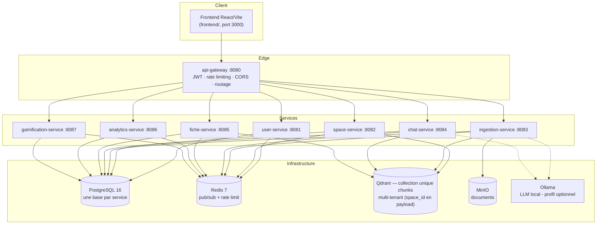

# 🌱 TsimokaAI

**TsimokaAI** (tsimoka = « bourgeon » en malgache) est une plateforme d'apprentissage
**augmentée par IA** : les étudiants déposent leurs supports de cours, posent des questions à
un assistant pédagogique alimenté par **RAG**, génèrent des **fiches de révision** et suivent
leur **progression** — le tout piloté par un ensemble de **microservices Spring Boot**.

> Mémoire de fin d'études — **M1 MIAGE**, ESMIA (Antananarivo).


---

## Sommaire

- [Fonctionnalités](#fonctionnalités)
- [Architecture](#architecture)
- [Stack technique](#stack-technique)
- [Structure du dépôt](#structure-du-dépôt)
- [Les services](#les-services)
- [Prérequis](#prérequis)
- [Démarrage rapide](#démarrage-rapide)
- [API & documentation](#api--documentation)
- [Tests](#tests)
- [Feuille de route](#feuille-de-route)
- [Limites connues](#limites-connues)
- [Contribuer](#contribuer)
- [Licence](#licence)

## Fonctionnalités

| Domaine | Ce que fait la plateforme |
|---|---|
| **Comptes & sessions** | Inscription, connexion, refresh token avec rotation, rôles (étudiant / enseignant) |
| **Espaces de cours** | Création d'espaces, groupes de travail, **persona pédagogique** par espace (instruction système du LLM) |
| **Ingestion de documents** | Upload PDF / DOCX / PPTX / XLSX / XLS / CSV / HTML / EPUB / TXT / Markdown, extraction **Markdown** (MarkItDown + vision **Gemini** : légende des figures, transcription des scans, images dans MinIO), **chunking orienté sens** (titres `#`/`##` d'abord, récursif si trop grand), **embeddings**, indexation **vectorielle** (Qdrant) |
| **Assistant RAG** | Conversations par espace, recherche sémantique dans les documents, réponse générée par LLM (Groq / Gemini / Ollama) |
| **Fiches de révision** | Génération **Map-Reduce**, partage (individuel / groupe), annotations, validation par l'enseignant |
| **Suivi & analytics** | Dashboards étudiant / enseignant, détection de notions difficiles, recommandations |
| **Gamification** | Objectifs de révision, badges, suivi hebdomadaire, rappels |

> ⚠️ **État des lieux** : la « plomberie » (CRUD, sécurité, événements, persistance, Docker)
> est fonctionnelle, ainsi que l'**ingestion complète** (extraction docling-worker + vision
> Gemini, chunking, embeddings, indexation Qdrant, spec v2), la **bascule de provider LLM**
> (Groq/Gemini/Ollama via `ai-common` + `ChatProviderResolver`), le **chat RAG** (pipeline
> custom : rewrite → retrieval large filtré `space_id` → rerank LLM → contexte), le **persona
> pédagogique** (génération + enrichissement par LLM) et la **génération Map-Reduce des
> fiches** (validation de structure par `StructuredOutputValidationAdvisor`). Il reste la
> **validation de bout en bout** avec l'infra complète (voir la [feuille de route](#feuille-de-route)).

## Architecture

8 microservices **Spring Boot** derrière une **gateway réactive** unique. Les services ne
communiquent **jamais** en synchrone entre eux : la propagation (suppressions en cascade,
compteurs, enrichissements) passe par **Redis Pub/Sub**.



Les échanges d'événements entre services sont détaillés dans [`common/README.md`](common/README.md).

## Stack technique

| Couche | Technologie | Version |
|---|---|---|
| Langage | Java | 17 |
| Framework | Spring Boot / Spring Cloud | 3.3.5 / 2023.0.3 |
| IA | Spring AI (Groq via OpenAI starter, Gemini via API OpenAI, Ollama) | 1.1.8 |
| Réactif | Spring Cloud Gateway (WebFlux) | — |
| Persistance | PostgreSQL 16 + Flyway | — |
| Vecteurs | Qdrant (client gRPC) | 1.13.0 |
| Cache / messages | Redis 7 (Pub/Sub) | — |
| Stockage objet | MinIO (compatible S3) | latest |
| Extraction | docling-worker (FastAPI / MarkItDown + vision Gemini) | — |
| Auth | JJWT + BCrypt (`spring-security-crypto`) | 0.12.6 |
| Mapping / code | MapStruct + Lombok | 1.6.2 / 1.18.34 |
| Documentation API | springdoc-openapi | 2.6.0 |

## Structure du dépôt

```
tsimokaai/
├── pom.xml                     # POM parent agrégateur (gestion de versions)
├── docker-compose.yml          # Orchestration locale complète
├── .env.example                # Variables d'environnement (à copier en .env)
├── common/                     # 📚 Lib partagée (enveloppe API, erreurs, événements, contexte) → README
├── ai-common/                  # 🧠 Lib IA partagée (résolveur de provider LLM, auto-configuration) → README
├── api-gateway/                # 🚪 Point d'entrée unique (JWT, routage, rate limit) → README
├── user-service/               # 🔐 Auth, comptes, JWT → README
├── space-service/              # 📁 Espaces, groupes, persona → README
├── ingestion-service/          # 📥 Upload, extraction, chunking, embeddings → README
├── chat-service/               # 💬 Conversations, orchestration RAG → README
├── fiche-service/              # 📄 Fiches, partage, annotations, validation → README
├── analytics-service/          # 📊 Dashboards, recommandations → README
├── gamification-service/       # 🏆 Objectifs, badges, rappels → README
├── docling-worker/             # 🐍 Conteneur d'extraction (MarkItDown + vision Gemini), spawné à la demande → README
├── infra/postgres-init/        # Création d'une base PostgreSQL par service
├── ARCHITECTURE.md             # Décisions & compromis architecturaux (base du mémoire)
└── docs/                       # Documentation complémentaire
```

Chaque dossier de service contient son propre **README** : choix techniques, règles métier,
diagrammes, endpoints, événements et **parties non implémentées**.

## Les services

| Service | Port | Rôle | État | Doc |
|---|---|---|---|---|
| `api-gateway` | 8080 | Point d'entrée unique, JWT, routage, rate limiting | ✅ Complet | [README](api-gateway/README.md) |
| `user-service` | 8081 | Auth, comptes, JWT (access + refresh) | ✅ Complet | [README](user-service/README.md) |
| `space-service` | 8082 | Espaces de cours, groupes, persona pédagogique | 🟢 Persona généré + enrichi par LLM — e2e à faire | [README](space-service/README.md) |
| `ingestion-service` | 8083 | Upload, extraction (docling-worker + vision Gemini), chunking, embedding, indexation | 🟢 Pipeline complet — test e2e à faire | [README](ingestion-service/README.md) |
| `chat-service` | 8084 | Conversations, orchestration RAG | 🟢 RAG (rewrite + retrieval + rerank LLM) — e2e à faire | [README](chat-service/README.md) |
| `fiche-service` | 8085 | Génération de fiches, partage, annotation, validation | 🟢 Génération Map-Reduce — e2e à faire | [README](fiche-service/README.md) |
| `analytics-service` | 8086 | Tableaux de bord, statistiques, recommandations | ✅ Complet | [README](analytics-service/README.md) |
| `gamification-service` | 8087 | Objectifs, badges, suivi hebdo, rappels | ✅ Complet | [README](gamification-service/README.md) |
| `frontend` | 3000 | SPA React/Vite (étudiant + enseignant), servie par nginx avec proxy `/api` → gateway | 🟢 Étudiant complet, enseignant v1 — e2e à faire | [README](frontend/README.md) |
| `common` | — | Lib partagée (JAR) | ✅ Stable | [README](common/README.md) |
| `ai-common` | — | Lib IA partagée (JAR) | ✅ Stable | [README](ai-common/README.md) |

## Prérequis

- **Docker** + **Docker Compose v2**
- **JDK 17** et **Maven 3.9+** (pour développer / lancer un service hors Docker)
- **Clé API Gemini** (`GEMINI_API_KEY`, https://aistudio.google.com/apikey) pour les figures
  et les documents scannés — docling-worker délègue la vision à Gemini (spec v2).
- ⚠️ **Builds validés** dans l'environnement du projet (Maven Central joignable) : les
  versions de dépendances et les fat-jars Spring Boot ont été vérifiés par une vraie build.

## Démarrage rapide

```bash
# 1. Configurer l'environnement
cp .env.example .env
#    → éditer .env (JWT_SECRET en particulier, et GEMINI_API_KEY pour docling-worker)

# 2. Lancer toute la plateforme
docker compose up --build

# Ollama est REQUIS pour l'ingestion : les embeddings sont générés localement
# (nomic-embed-text). Sans lui, un document resterait en PENDING ou passerait en FAILED.
docker compose --profile ollama up --build

# 3. (Une seule fois) Construire le conteneur d'extraction docling-worker — REQUIS avant
#    tout upload de document : il est spawné à la demande par ingestion-service (pas un
#    service permanent de docker-compose.yml). La clé Gemini est injectée au runtime.
docker build -t docling-worker:latest ./docling-worker
```

Une fois démarré :

| Ressource | URL |
|---|---|
| Frontend (point d'entrée utilisateur) | http://localhost:3000 |
| Gateway (point d'entrée API) | http://localhost:8080 |
| Swagger par service | http://localhost:`<port>`/swagger-ui.html |
| Console MinIO | http://localhost:9001 |
| Dashboard Qdrant | http://localhost:6333/dashboard |

Le frontend est servi par nginx qui **proxifie `/api` vers la gateway** : le navigateur
ne parle qu'à http://localhost:3000 (même origine, zéro CORS). En dev hors Docker,
`npm run dev` dans `frontend/` appelle directement la gateway (`VITE_API_BASE_URL`,
cf. `frontend/.env.example`).

### Test rapide bout-en-bout

```bash
# 1. Inscription → récupérer accessToken dans la réponse
curl -X POST http://localhost:8080/api/v1/auth/register \
  -H "Content-Type: application/json" \
  -d '{"email":"etu@example.com","password":"motdepasse123","displayName":"Etu Test"}'

# 2. Créer un espace de cours (avec le token ci-dessus)
curl -X POST http://localhost:8080/api/v1/spaces \
  -H "Authorization: Bearer <accessToken>" \
  -H "Content-Type: application/json" \
  -d '{"name":"Algèbre linéaire","subjectTag":"Mathématiques"}'

# 3. Un autre utilisateur rejoint l'espace avec son code d'invitation
#    (le code est visible par le propriétaire : GET /api/v1/spaces/{id}/invite-code)
curl -X POST http://localhost:8080/api/v1/spaces/join \
  -H "Authorization: Bearer <accessTokenAutreEtudiant>" \
  -H "Content-Type: application/json" \
  -d '{"code":"A7K2M9XQ"}'
```

### Lancer un seul service en local (développement)

```bash
# Démarrer uniquement l'infra dont le service a besoin, ex. pour chat-service
# (provider par défaut = ollama, embeddings inclus) :
docker compose --profile ollama up -d postgres redis qdrant ollama

cd chat-service
mvn -pl ../common,../ai-common,. -am spring-boot:run \
  -Dspring-boot.run.arguments="--DB_URL=jdbc:postgresql://localhost:5432/chat_db"
```

## API & documentation

- **Swagger UI** : chaque service expose sa spec OpenAPI à
  `http://localhost:<port>/swagger-ui.html` (accès direct hors gateway, pratique en dev).
- **Enveloppe de réponse uniforme** sur toutes les APIs :
  `{ success: boolean, data?: any, error?: { code, message, details }, meta: { timestamp, requestId } }`.
- **Sécurité** : le JWT est vérifié **uniquement à la gateway**, qui enrichit chaque requête
  de `X-User-Id`, `X-User-Role`, `X-Request-Id`. Les services font confiance à ces headers
  (`common/` les lit automatiquement).

## Tests

- **`docling-worker`** : tests unitaires Python (extraction, placeholders, transcription,
  plafond d'images, dégradation Gemini) — `python -m unittest tests.test_converter -v`
  (dans `docling-worker/`).
- **Services Java** : `ingestion-service` dispose de tests unitaires pour le chunking
  (`MarkdownChunkingServiceTest`) ; les autres services ont `spring-boot-starter-test` en place
  sans tests écrits (scaffold généré). Ajout de tests d'intégration par service **recommandé**
  en parallèle de la validation du cœur IA (voir [Contribuer](#contribuer)).

## Feuille de route

Chaque TODO est documenté en Javadoc dans le code concerné. Ce sont les travaux à combler
pour le mémoire :

1. **`ingestion-service`** — pipeline implémenté (extraction docling-worker + vision Gemini,
   chunking orienté sens `MarkdownChunkingService` couvert par tests unitaires, embeddings
   Ollama, upsert Qdrant) : il reste à réaliser le **test de bout en bout** avec toute l'infra
   (Ollama démarré) et à ajuster les paramètres de chunking empiriquement.
2. **`space-service` / `PersonaService`** — génération + enrichissement du persona par LLM
   (prompts `persona-generation.st` / `persona-enrichment.st`, échantillon de chunks Qdrant,
   circuit breaker `llm-persona`) : à valider en e2e avec un document réel.
3. **`chat-service` / `ChatService`** — pipeline RAG custom (`RagPipelineAdvisor` :
   rewrite LLM → retrieval large filtré `space_id` → rerank LLM topN → contexte augmenté),
   historique par `JpaBackedChatMemory` + `MessageChatMemoryAdvisor`, circuit breaker
   `llm-chat`. Reste : validation e2e avec l'infra complète + `tokenCount` + Gemini.
4. **`fiche-service` / `FicheGenerationService`** — génération Map-Reduce des fiches
   (prompts `fiche-map.st` / `fiche-reduce.st`, `StructuredOutputValidationAdvisor`,
   circuit breaker `llm-fiche`) : à valider en e2e.
5. **Enrichir `FicheEvent.validated()`** (`userId`/`spaceId` de l'étudiant) pour débloquer la
   progression analytics et le badge « première fiche validée ».

Extensions possibles (non bloquantes) : livraison réelle des rappels (SMTP/push), extraction
sémantique des notions (NLP/embeddings), idempotence stricte des listeners d'événements.

## Limites connues

Détaillées dans [`ARCHITECTURE.md`](ARCHITECTURE.md) §7 et dans chaque README de service. Les
plus structurantes :

- **Gemini externalisé** : figures/scan dépendent d'un appel réseau payant (quota) ; sans
  `GEMINI_API_KEY`, les documents textuels restent fonctionnels, les légendes/transcriptions
  sont vides (warning non bloquant).
- **Confiance aux headers** : un service accédé directement hors gateway n'est pas protégé.
- **Cohérence éventuelle** : les suppressions en cascade passent par Redis Pub/Sub (pas de
  garantie de livraison unique → idempotence à durcir).
- `extractNotion()` (analytics) est une heuristique lexicale, pas une extraction sémantique.

## Contribuer

1. Fork du dépôt, créer une branche `feat/…` ou `fix/…`.
2. Respecter les conventions du projet : enveloppe `ApiResponse`, événements idempotents,
   fichiers dans `common/` pour tout ce qui est transverse, migrations Flyway pour le schéma.
3. Chaque service est documenté — mettre à jour son README si le comportement change.
4. Commits conventionnels et messages en français (conforme au reste du dépôt).
5. Ouvrir une Pull Request décrivant les choix techniques effectués.

## Licence

Projet pédagogique (mémoire M1 MIAGE). Licence **non définie** pour l'instant — à préciser
avant toute diffusion.

---

*Documentation complémentaire : [`ARCHITECTURE.md`](ARCHITECTURE.md) trace les décisions
structurantes et leurs compromis (utile pour la rédaction du mémoire).*
