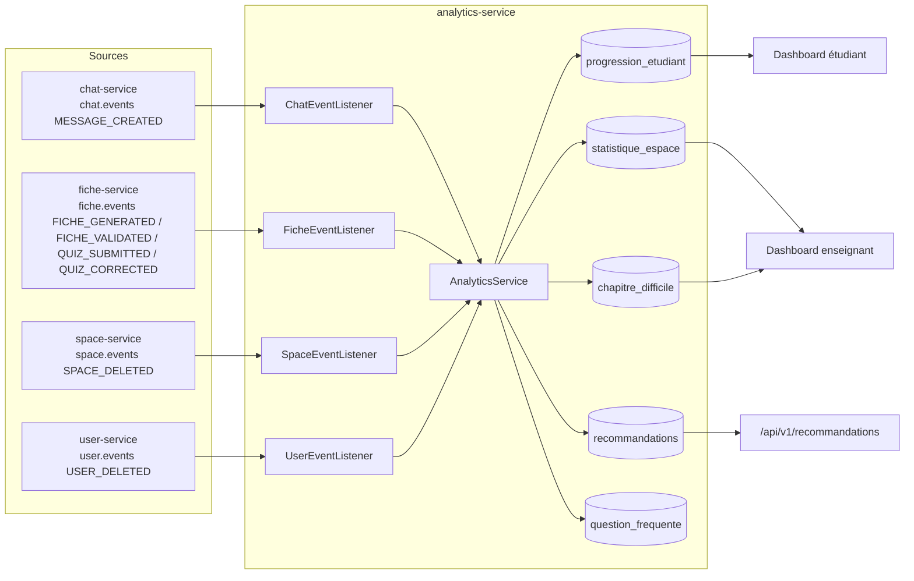

# analytics-service

> **Statut :** ✅ Complet
> **Port :** `8086` · **Base :** `analytics_db` (PostgreSQL)

Tableaux de bord, statistiques d'usage et recommandations. **Aucun accès direct** aux bases
des autres services : ce service est alimenté **exclusivement par consommation d'événements**
(`chat.events`, `fiche.events`, `space.events`, `user.events`). **Ne publie aucun événement**
(c.-à-d. consommateur pur). Implémentation **complète**.

## Rôle

- **Dashboard étudiant** : progression par espace (questions posées, fiches générées, notions
  maîtrisées/faibles, taux de réussite, dernière activité, top 10 recommandations).
- **Dashboard enseignant** : top 10 notions les plus questionnées, chapitres difficiles,
  nombre d'étudiants actifs (COUNT), **top 10 questions fréquentes** (question brute
  normalisée) et **évolution de l'activité sur 12 semaines** (semaine en cours incluse,
  par `derniere_activite`).
- **Recommandations** : générées automatiquement quand une notion est questionnée de façon
  répétée (signal de difficulté). **Seul le type `CHAPITRE_DIFFICILE` est effectivement
  généré** ; les types `REVISION_NOTION_FAIBLE` et `RELANCE_INACTIVITE` existent dans l'enum
  mais ne sont pas encore implémentés (voir « Limites connues »).

## Choix techniques

- **Architecture événementielle pure** : `analytics-service` ne possède aucun appel synchrone
  vers les autres services. Ses tables (`progression_etudiant`, `statistique_espace`, etc.)
  sont une **vue matérialisée** reconstruite à partir des événements. Avantage : découplage
  total et cohérence par événement (eventual consistency, acceptable ici).
- **Déduplication des questions** : seul le message `role = USER` déclenche un comptage de
  question (`ChatEventListener` filtre les `MESSAGE_CREATED`).
- **Heuristique `extractNotion`** : la « notion » est le **premier mot significatif** (hors
  mots vides, longueur > 4) de la question. Simple et déterministe ; un raffinement
  NLP/embeddings est possible mais non bloquant.
- **Seuil de difficulté arbitraire** : une notion questionnée **exactement 3, 6, 9… fois**
  (c.-à-d. `nb_questions % 3 == 0`) dans le même espace alimente `chapitre_difficile`
  (+1 au score) et génère une recommandation de relecture. Seuil ajustable dans
  `AnalyticsService` (`NOTION_FAIBLE_SEUIL = 3`).
- **Quiz sur canal unique `fiche.events`** : `FicheEventListener` dispatche sur `JsonNode`
  (champ `event`) les payloads `FICHE_*` **et** `QUIZ_SUBMITTED` / `QUIZ_CORRECTED`
  (format producteur fiche-service : `score`/`total` en Integer, `userIdEtu` pour les
  corrections). `QUIZ_SUBMITTED` incrémente `nb_quiz_passes` + met à jour
  `dernier_score` / `meilleur_score` (en %) ; `QUIZ_CORRECTED` ne rejoue pas le quiz
  (scores + activité uniquement). Score **< 50 % répété** (précédent < 50 % ou
  `nb_quiz_passes >= 2` avec `meilleur_score < 50 %`) → recommandation
  `CHAPITRE_DIFFICILE` (« Tes derniers quiz sont sous les 50 %… »).
- **`QuizEvent` local deprecated** : le record `messaging/QuizEvent.java` n'est conservé
  que pour les constantes `QUIZ_SUBMITTED` / `QUIZ_CORRECTED` et la traçabilité du format
  historique ; il n'est plus désérialisé. L'ancien `QuizEventListener` dédié est
  désactivé (plus de bean Spring) et le canal historique dédié `quiz.events` est
  **supprimé du câblage** (`RedisListenerConfig` n'y souscrit plus).
- **Métriques de progression recalculées** : `refreshProgressionMetrics()` est appelé après
  chaque événement (question, fiche générée/validée enrichie, quiz) et avant le dashboard
  étudiant : `taux_reussite = min(1, nb_fiches_generees / nb_questions_posees)`,
  `notions_faibles` = notions avec `nb_questions >= 3`, `notions_maitrisees` = notions
  avec `0 < nb_questions < 3`.

## Flux de données



## Endpoints

Toutes les routes sont protégées par JWT.

| Méthode | Route | Rôle | Description |
|---|---|---|---|
| GET | `/api/v1/dashboard/student?spaceId={id}` | connecté | Tableau de bord de l'étudiant courant pour un espace |
| GET | `/api/v1/dashboard/teacher?spaceId={id}` | enseignant (admin) | Tableau de bord de l'espace (notions, chapitres, actifs, questions fréquentes, évolution 12 semaines) |
| GET | `/api/v1/dashboard/teacher/students?spaceId={id}` | enseignant (admin) | Lignes étudiants de l'espace (progression par étudiant) |
| GET | `/api/v1/dashboard/teacher/recommandations?spaceId={id}&studentId={id}` | enseignant (admin) | Recommandations d'un étudiant de l'espace (404 si étudiant hors espace) |
| GET | `/api/v1/recommandations?spaceId={id}` | connecté | Recommandations de l'étudiant courant (réutilise le calcul du dashboard) |

## Règles métier

- **Le dashboard enseignant est réservé aux enseignants** (`ctx.isAdmin()` → `403` sinon).
- **Notion difficile** : `nb_questions % 3 == 0` → incrément du score + recommandation
  « Tu as posé plusieurs questions sur "…". Une relecture de ce chapitre pourrait aider. »
  **Seul le type `CHAPITRE_DIFFICILE` est généré** ; `REVISION_NOTION_FAIBLE` et
  `RELANCE_INACTIVITE` existent dans l'enum mais ne sont pas encore branchés.
- **Progression unique par (étudiant, espace)** : contrainte `UNIQUE(user_id, space_id)`.
- **`FICHE_VALIDATED` exploité si enrichi** : `onFicheValidated(userId, spaceId, statut)`
  crédite la progression (`derniere_activite` + `refreshProgressionMetrics`) quand
  `userId`/`spaceId` sont renseignés par le producteur ; sinon (contrat historique avec
  `null`s) l'événement est seulement journalisé, sans imputation.
- **`taux_reussite` / `notions_maitrisees` / `notions_faibles`** sont recalculés via
  `refreshProgressionMetrics` (voir « Choix techniques »), pas stockés à la main.
- **Quiz** : `QUIZ_SUBMITTED` → +1 `nb_quiz_passes`, `dernier_score` / `meilleur_score`
  (en %) ; `QUIZ_CORRECTED` → scores + activité (pas de +1). Payload incomplet →
  warn + ignoré, jamais d'exception. Score < 50 % répété → `CHAPITRE_DIFFICILE`.
- La suppression d'un utilisateur purge ses données `progression_etudiant` et
  `recommandations` (`USER_DELETED`). `statistique_espace` et `chapitre_difficile` ne sont
  **pas affectées** car elles sont liées à un espace (pas à un utilisateur).
- La suppression d'un espace purge ses données `progression_etudiant`, `statistique_espace`,
  `chapitre_difficile`, `recommandations` **et `question_frequente`** (`SPACE_DELETED`).

## Modèle de données

- `progression_etudiant` : `user_id`, `space_id`, `taux_reussite`, `notions_maitrisees`/`notions_faibles`
  (JSONB), `nb_questions_posees`, `nb_fiches_generees`, **`nb_quiz_passes`,
  `meilleur_score` / `dernier_score` (en %, V2)**, `derniere_activite`, `UNIQUE(user_id, space_id)`.
- `statistique_espace` : `space_id`, `notion`, `nb_consultations`, `nb_questions`, `UNIQUE(space_id, notion)`.
  **Note :** `nb_consultations` et `nb_questions` sont toujours incrémentés ensemble ;
  les deux champs sont redondants (conçu historiquement pour des cas d'usage futurs).
- `chapitre_difficile` : `space_id`, `chapitre`, `score_difficulte`, `UNIQUE(space_id, chapitre)`.
- `recommandations` : `user_id`, `space_id`, `type` (`REVISION_NOTION_FAIBLE` |
  `CHAPITRE_DIFFICILE` | `RELANCE_INACTIVITE`), `contenu`, `generee_le`.
- `question_frequente` (**V2** — `V2__quiz_and_questions.sql`) : `space_id`,
  `question_normalisee` (VARCHAR 280, lowercase/trim/collapse, tronquée), `nb_occurrences`,
  `dernier_ask`, `UNIQUE(space_id, question_normalisee)`. Alimentée par upsert à chaque
  question (`onQuestionAsked`) ; exposée en top 10 dans le dashboard enseignant.
  La même migration V2 ajoute `nb_quiz_passes`, `meilleur_score`, `dernier_score` à
  `progression_etudiant` (dashboard enseignant : `evolution` 12 semaines calculée en Java
  depuis `derniere_activite`, pas de table dédiée).

## Non implémenté / limites connues

- **Types de recommandation non implémentés** : seuls les enregistrements de type
  `CHAPITRE_DIFFICILE` sont créés. `REVISION_NOTION_FAIBLE` et `RELANCE_INACTIVITE`
  existent dans l'enum mais aucune logique ne les produit actuellement. À brancher
  lorsque les conditions correspondantes seront définies.
- **`FICHE_VALIDATED` non enrichi non imputable** : sans `userId`/`spaceId` (contrat
  historique : l'événement ne portait que `enseignantId`), `onFicheValidated()` se
  contente de journaliser. L'imputation utilise l'**événement enrichi désormais publié
  côté fiche-service** (`userId`/`spaceId` réels, publish-after-commit). Limite documentée
  dans `ARCHITECTURE.md` §7.
- **`QUIZ_CORRECTED`** : la correction **au niveau tentative** porte le score effectif
  (corrigé si fourni, sinon score auto) + `total` → scores + activité (pas de +1). La
  correction **au niveau quiz** (sans `attemptId` / sans `userIdEtu`) est incomplète →
  warn + ignorée, jamais d'exception. Score < 50 % répété → `CHAPITRE_DIFFICILE`.
- **Idempotence des listeners** : dispatch `JsonNode` tolérant (champ `event`), garde-fous
  `UNIQUE` (progression, upsert question) ; les compteurs sont rejoués en cas de
  redélivrance Redis (at-least-once). À durcir via déduplication Set Redis (TODO commentés
  : clé `messageId` / `ficheId` / `attemptId`, SETNX + TTL).
- **`extractNotion` est une heuristique lexicale** : pas d'extraction sémantique (suffisante
  pour peupler les dashboards, améliorable par NLP/embeddings).

## Événements consommés

| Canal | Événement | Impact |
|---|---|---|
| `chat.events` | `MESSAGE_CREATED` (USER) | +1 question, upsert `question_frequente`, mise à jour `statistique_espace`, `refreshProgressionMetrics`, détection notion difficile |
| `fiche.events` | `FICHE_GENERATED` | +1 fiche générée (+ `refreshProgressionMetrics`) |
| `fiche.events` | `FICHE_VALIDATED` | Exploité **si `userId`/`spaceId` enrichis** (crédit progression + `refreshProgressionMetrics`), sinon journalisé |
| `fiche.events` | `QUIZ_SUBMITTED` | +1 `nb_quiz_passes`, scores en %, `refreshProgressionMetrics`, reco `CHAPITRE_DIFFICILE` si < 50 % répété |
| `fiche.events` | `QUIZ_CORRECTED` | Scores + activité (pas de +1), même règle < 50 % ; ignoré si score/total absents |
| `space.events` | `SPACE_DELETED` | Purge totale de l'espace (`progression`, `statistique`, `chapitre`, `recommandations`, `question_frequente`) |
| `user.events` | `USER_DELETED` | Purge `progression_etudiant` + `recommandations` de l'utilisateur (pas `statistique_espace` / `chapitre_difficile`, espace-scopées) |

> Canal historique dédié `quiz.events` : **supprimé du câblage** (canal unique
> `fiche.events`, cf. `RedisListenerConfig`). Record local `messaging/QuizEvent.java`
> **deprecated** (constantes + traçabilité uniquement) ; ancien `QuizEventListener`
> désactivé (fusionné dans `FicheEventListener`).

## Lancer

```bash
docker compose up -d postgres redis
mvn -pl common,analytics-service -am spring-boot:run
# Swagger : http://localhost:8086/swagger-ui.html
```
