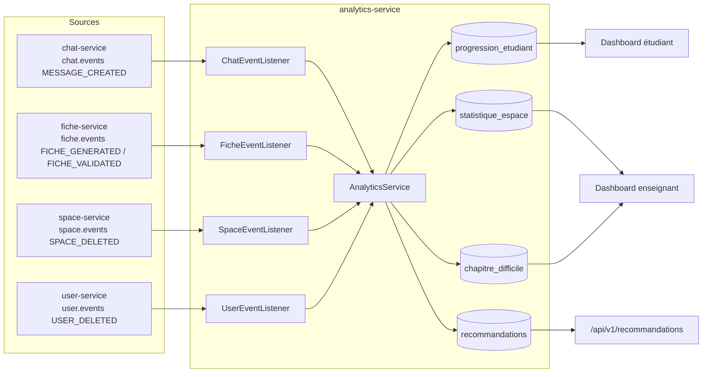

# analytics-service

> **Statut :** ✅ Complet
> **Port :** `8086` · **Base :** `analytics_db` (PostgreSQL)

Tableaux de bord, statistiques d'usage et recommandations. **Aucun accès direct** aux bases
des autres services : ce service est alimenté **exclusivement par consommation d'événements**
(`chat.events`, `fiche.events`, `space.events`, `user.events`). Implémentation **complète**.

## Rôle

- **Dashboard étudiant** : progression par espace (questions posées, fiches générées, notions
  maîtrisées/faibles, taux de réussite, dernière activité, top 10 recommandations).
- **Dashboard enseignant** : top 10 notions les plus questionnées, chapitres difficiles,
  nombre d'étudiants actifs.
- **Recommandations** : générées automatiquement quand une notion est questionnée de façon
  répétée (signal de difficulté).

## Choix techniques

- **Architecture événementielle pure** : `analytics-service` ne possède aucun appel synchrone
  vers les autres services. Ses tables (`progression_etudiant`, `statistique_espace`, etc.)
  sont une **vue matérialisée** reconstruite à partir des événements. Avantage : découplage
  total et cohérence par événement (eventual consistency, acceptable ici).
- **Déduplication des questions** : seul le message `role = USER` déclenche un comptage de
  question (`ChatEventListener` filtre les `MESSAGE_CREATED`).
- **Heuristique `extractNotion`** : la « notion » est le **premier mot significatif** (hors
  mots vides, longueur > 3) de la question. Simple et déterministe ; un raffinement
  NLP/embeddings est possible mais non bloquant.
- **Seuil de difficulté arbitraire** : une notion questionnée **plus de 3 fois** dans le même
  espace alimente `chapitre_difficile` (+1 au score) et génère une recommandation de relecture.
  Seuil ajustable dans `AnalyticsService`.

## Flux de données



## Endpoints

Toutes les routes sont protégées par JWT.

| Méthode | Route | Rôle | Description |
|---|---|---|---|
| GET | `/api/v1/dashboard/student?spaceId={id}` | connecté | Tableau de bord de l'étudiant courant pour un espace |
| GET | `/api/v1/dashboard/teacher?spaceId={id}` | enseignant (admin) | Tableau de bord de l'espace (notions, chapitres, actifs) |
| GET | `/api/v1/recommandations?spaceId={id}` | connecté | Recommandations de l'étudiant courant (réutilise le calcul du dashboard) |

## Règles métier

- **Le dashboard enseignant est réservé aux enseignants** (`ctx.isAdmin()` → `403` sinon).
- **Notion difficile** : `nb_questions % 3 == 0` → incrément du score + recommandation
  « Tu as posé plusieurs questions sur "…". Une relecture de ce chapitre pourrait aider. »
- **Progression unique par (étudiant, espace)** : contrainte `UNIQUE(user_id, space_id)`.
- La suppression d'un espace ou d'un utilisateur purge les données analytics correspondantes
  (événements `SPACE_DELETED` / `USER_DELETED`).

## Modèle de données

- `progression_etudiant` : `user_id`, `space_id`, `taux_reussite`, `notions_maitrisees`/`notions_faibles`
  (JSONB), `nb_questions_posees`, `nb_fiches_generees`, `derniere_activite`, `UNIQUE(user_id, space_id)`.
- `statistique_espace` : `space_id`, `notion`, `nb_consultations`, `nb_questions`, `UNIQUE(space_id, notion)`.
- `chapitre_difficile` : `space_id`, `chapitre`, `score_difficulte`, `UNIQUE(space_id, chapitre)`.
- `recommandations` : `user_id`, `space_id`, `type` (`REVISION_NOTION_FAIBLE` |
  `CHAPITRE_DIFFICILE` | `RELANCE_INACTIVITE`), `contenu`, `generee_le`.

## Non implémenté / limites connues

- **`FICHE_VALIDATED` non exploité** : l'événement ne porte que `enseignantId` (pas l'étudiant
  auteur de la fiche) → `onFicheValidated()` se contente de journaliser. L'impact sur la
  progression d'un étudiant précis nécessite d'**enrichir l'événement côté fiche-service**
  (`userId`/`spaceId` de la fiche concernée). Limite documentée dans `ARCHITECTURE.md` §7.
- **`taux_reussite`, `notions_maitrisees`, `notions_faibles` jamais mis à jour** par les
  événements actuels : ils restent à leurs valeurs par défaut. À alimenter (ex. en s'appuyant
  sur les statuts de validation enrichis).
- **`extractNotion` est une heuristique lexicale** : pas d'extraction sémantique (suffisante
  pour peupler les dashboards, améliorable par NLP/embeddings).
- **Idempotence des listeners** : les compteurs sont incrémentés sans clé de déduplication ;
  un événement reçu deux fois **double le compteur**. En l'état, la livraison Redis Pub/Sub
  étant best-effort, ce n'est pas bloquant mais c'est à durcir (idempotence stricte).

## Événements consommés

| Canal | Événement | Impact |
|---|---|---|
| `chat.events` | `MESSAGE_CREATED` (USER) | +1 question, mise à jour `statistique_espace`, détection notion difficile |
| `fiche.events` | `FICHE_GENERATED` | +1 fiche générée |
| `fiche.events` | `FICHE_VALIDATED` | Journalisé (non exploité, cf. ci-dessus) |
| `space.events` | `SPACE_DELETED` | Purge totale de l'espace |
| `user.events` | `USER_DELETED` | Purge des données de l'utilisateur |

## Lancer

```bash
docker compose up -d postgres redis
mvn -pl common,analytics-service -am spring-boot:run
# Swagger : http://localhost:8086/swagger-ui.html
```
