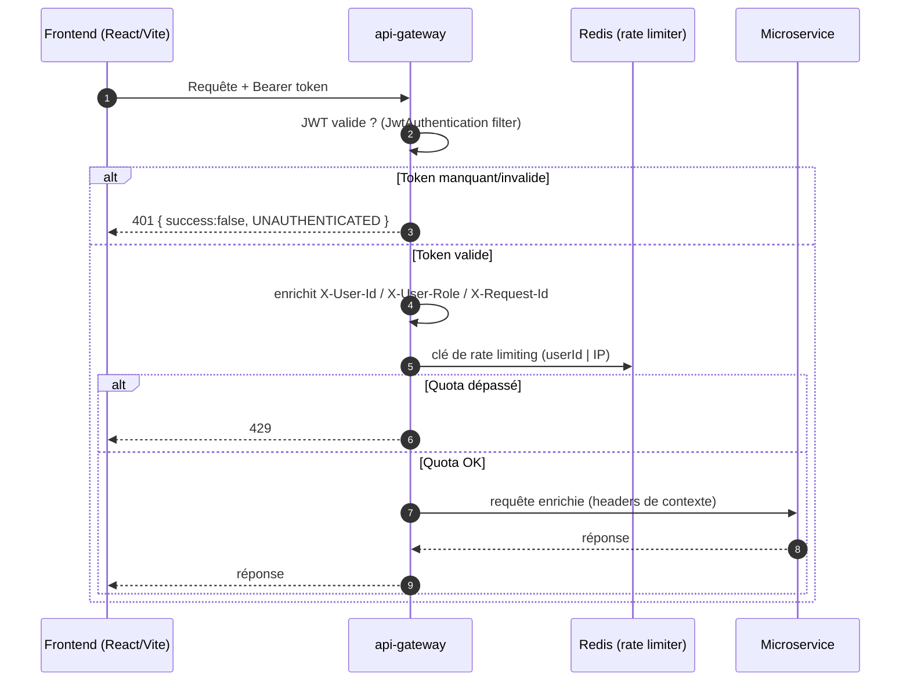

# api-gateway

> **Statut :** ✅ Complet
> **Port :** `8080` · **Framework :** Spring Cloud Gateway (WebFlux / réactif)

Point d'entrée **unique** de la plateforme. Le frontend React/Vite (`frontend/`, nginx en
Docker) ne parle jamais directement à un microservice : toute requête passe par cette
gateway — nginx proxifie `/api` vers elle, et `VITE_API_BASE_URL` pointe dessus en dev.

## Rôle

1. **Vérification du JWT** : seule composante de la plateforme qui valide les tokens émis
   par `user-service`.
2. **Enrichissement** : ajoute `X-User-Id`, `X-User-Role`, `X-Request-Id` avant d'envoyer
   la requête au service cible (contrat de confiance aux headers, cf. `common/`).
3. **Routage** : achemine chaque préfixe `/api/v1/**` vers le bon microservice.
4. **Rate limiting** : limitation par utilisateur (ou par IP pour les routes publiques).
5. **CORS** centralisé (un seul point exposé au navigateur).

## Choix techniques

- **Spring Cloud Gateway réactif** (`WebFlux`) plutôt que Spring MVC : le gateway est un
  proxy asynchrone non bloquant, adapté à un fort nombre de connexions concurrentes.
  Conséquence : **il ne dépend pas du module `common`** (qui est servlet/MVC) pour son propre
  code — il reproduit l'enveloppe de réponse dans `GlobalErrorWebExceptionHandler`.
- **JWT vérifié ici, et nulle part ailleurs** : la logique de signature/validation n'est
  dupliquée dans aucun service backend. Seule la clé `JWT_SECRET` est partagée (avec
  `user-service`).
- **Rate limiting Redis token bucket** : `RequestRateLimiter` de Spring Cloud Gateway,
  backend Redis (déjà présent pour la messagerie). Clé = `X-User-Id` si authentifié,
  sinon IP distante (`RateLimiterConfig`).
- **Retry sur GET** : filtre global `Retry` (1 nouvelle tentative) pour les requêtes de
  lecture, histoire d'absorber un redémarrage de service upstream.
- **Enveloppe d'erreur uniforme** : les erreurs de routage/upstream (service indisponible,
  timeout, 404) sont traduites en `{ success:false, error, meta }`, cohérent avec les services.

## Flux d'une requête



## Table des routes

Toutes les routes sont protégées par JWT **sauf** `/api/v1/auth/**` (publique).

| Préfixe | Service cible | Rate limit | Filtre JWT |
|---|---|---|---|
| `/api/v1/auth/**` | user-service (8081) | 5 req/s, burst 10 (par IP) | ❌ publique |
| `/api/v1/users/**` | user-service (8081) | 20 req/s, burst 40 | ✅ |
| `/api/v1/spaces/**`, `/api/v1/groupes/**` | space-service (8082) | — | ✅ |
| `/api/v1/documents/**` | ingestion-service (8083) | — | ✅ |
| `/api/v1/conversations/**`, `/api/v1/messages/**` | chat-service (8084) | — | ✅ |
| `/api/v1/fiches/**`, `/api/v1/annotations/**`, `/api/v1/validations/**` | fiche-service (8085) | — | ✅ |
| `/api/v1/dashboard/**`, `/api/v1/recommandations/**` | analytics-service (8086) | — | ✅ |
| `/api/v1/objectifs/**`, `/api/v1/badges/**`, `/api/v1/rappels/**` | gamification-service (8087) | — | ✅ |

> Note : les routes espaces/groupes, conversations/messages, etc. partagent un même
> préfixe de rate limit implicite — seul `/auth` et `/users` ont une configuration
> `RequestRateLimiter` explicite dans `application.yml`.

## Variables d'environnement

| Variable | Défaut | Rôle |
|---|---|---|
| `SERVER_PORT` | `8080` | Port d'écoute |
| `REDIS_HOST` / `REDIS_PORT` | `localhost` / `6379` | Redis (rate limiter) |
| `JWT_SECRET` | — (dev) | Clé HMAC de signature, **doit être identique à user-service** |
| `*_SERVICE_URL` | `http://localhost:808x` | URI de chaque service cible |

## Non implémenté / limites connues

- **Erreur dans `application.yml`** : le bloc `f:` (lignes 103-110) devrait être
  `management:` — la configuration des endpoints d'actuator de la gateway est donc
  **silencieusement ignorée**. À corriger.
- **Pas de RBAC par route** : le filtre JWT ne vérifie aucun rôle (le champ `role` est
  extrait et transmis, mais aucune route n'est restreinte à un rôle précis au niveau gateway ;
  les restrictions métier sont faites dans les services, ex. validation des fiches).
- **Confiance aux headers** : un service backend joint directement (hors gateway) sans
  passer par la vérification JWT est vulnérable — limite documentée dans `ARCHITECTURE.md` §2.
- Le filtre est un `GatewayFilterFactory` appliqué route par route ; si une route protégée
  est ajoutée sans le filtre, elle devient publique.

## Lancer

```bash
# Seul, en local (il faut Redis) :
docker compose up -d redis
mvn -pl common,api-gateway -am spring-boot:run
```
