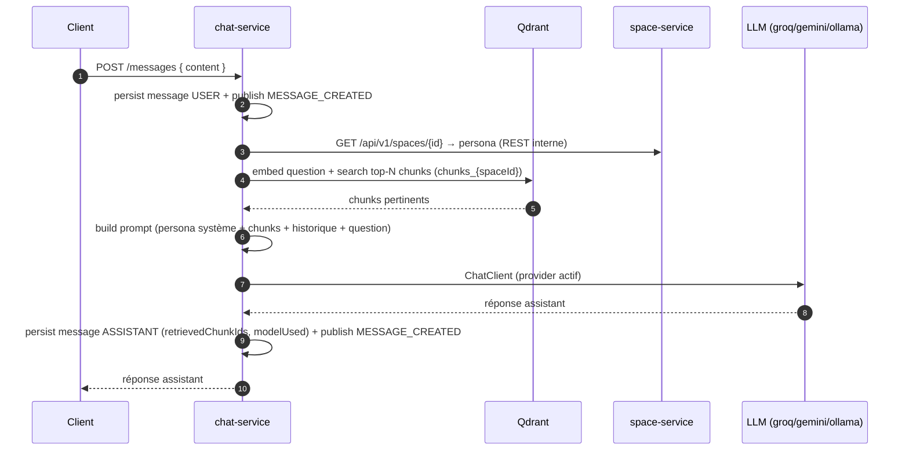

# chat-service

> **Statut :** 🟡 Historique complet — orchestration RAG en **TODO**
> **Port :** `8084` · **Base :** `chat_db` (PostgreSQL) · **Vecteurs :** Qdrant · **LLM :** Groq / Gemini / Ollama

Conversations, messages et **orchestration RAG** (Retrieval-Augmented Generation). L'historique
de conversation (persistance, endpoints, événements) est **complet** ; la boucle RAG
(retrieval Qdrant + prompt = persona + appel LLM) est le **cœur IA à implémenter** (`ChatService`
+ `LlmProviderConfig`).

## Rôle

1. Créer des conversations (rattachées à un espace) et lire l'historique.
2. Envoyer un message : construire la réponse de l'assistant en s'appuyant sur le contenu des
   documents indexés dans Qdrant (RAG) et le **persona** de l'espace.
3. Publier `MESSAGE_CREATED` pour **chaque** message (utilisateur **et** assistant) — c'est ce
   qui alimente `analytics-service`.

## Choix techniques

- **Modèle de messages typé** : `role` (`USER` / `ASSISTANT`), traçabilité RAG native
  (`retrieved_chunk_ids UUID[]` sur une colonne PostgreSQL, fidèle au schéma du contrat),
  `model_used`, `token_count`.
- **Bascule de provider LLM par configuration** : `ACTIVE_LLM_PROVIDER` ∈
  `groq | gemini | ollama` (via `LlmProviderConfig`).
  - **Groq** : API compatible OpenAI → le starter Spring AI **OpenAI** est pointé sur
    `https://api.groq.com/openai` (aucun SDK spécifique requis). Modèle par défaut
    `llama-3.3-70b-versatile`.
  - **Ollama** : fallback **100 % local / hors-ligne** (soutenance sans connexion).
    Modèle par défaut `qwen2.5:3b`.
  - **Gemini** : *non câblé* — voir « Point ouvert » ci-dessous.
- **Spring AI `ChatClient`** : le starter instancie un `ChatModel` par starter présent sur le
  classpath ; le **choix dynamique** du modèle actif n'est pas encore implémenté (TODO).
- **Paramètres de RAG configurables** : `CHAT_MAX_RETRIEVED_CHUNKS` (5) et
  `CHAT_MAX_HISTORY_MESSAGES` (10).
- **Historique persistant** : chaque réponse consomme l'historique récent comme contexte.

## Orchestration RAG (cible)



> ❗ **État actuel** : le squelette persiste bien les deux messages et publie les événements
> attendus, mais renvoie une **réponse statique** (« pipeline RAG non encore implémenté ») au
> lieu d'un vrai appel RAG + LLM.

## Endpoints

Toutes les routes sont protégées par JWT ; l'accès à une conversation est restreint à son
propriétaire.

| Méthode | Route | Rôle | Description |
|---|---|---|---|
| POST | `/api/v1/conversations` | connecté | Créer une conversation (espace requis, titre optionnel) |
| GET | `/api/v1/conversations?spaceId={id}` | connecté | Lister **mes** conversations d'un espace |
| POST | `/api/v1/conversations/{id}/messages` | propriétaire | Envoyer un message → réponse RAG de l'assistant |
| GET | `/api/v1/conversations/{id}/messages` | propriétaire | Historique complet (ordre chronologique) |

## Règles métier

- **Seul le propriétaire** de la conversation peut y lire/écrire (`403` sinon).
- **Deux messages par tour** : un `USER` puis un `ASSISTANT`, chacun publié sur
  `chat.events`. `analytics-service` ne compte que les messages `USER` comme questions.
- `retrieved_chunk_ids` et `model_used` ne sont remplis que par le vrai pipeline (actuellement
  tableau vide / `"TODO"`).
- Les messages sont horodatés et ordonnés par `created_at` (historique stable).

## Événements

| Canal | Événement | Direction | Rôle |
|---|---|---|---|
| `chat.events` | `MESSAGE_CREATED` | publié | Statistiques d'usage + détection de notions difficiles (analytics-service) |
| `space.events` | `SPACE_DELETED` | consommé | Purge des conversations de l'espace |
| `user.events` | `USER_DELETED` | consommé | Purge des conversations de l'utilisateur |

## Modèle de données

- `conversations` : `id`, `space_id` (logique), `user_id` (logique), `title`, horodatages.
- `messages` : `id`, `conversation_id (FK cascade)`, `role`, `content`, `retrieved_chunk_ids UUID[]`,
  `model_used`, `token_count`, `created_at`.

## Non implémenté (cœur IA du mémoire)

1. **Retrieval Qdrant** : embedder la question (même modèle d'embedding qu'ingestion-service),
   chercher les `CHAT_MAX_RETRIEVED_CHUNKS` chunks les plus proches dans `chunks_{spaceId}`.
2. **Récupération du persona** : appel REST service-à-service vers
   `GET /api/v1/spaces/{id}` (via la gateway ou WebClient direct — à trancher et documenter).
3. **Construction du prompt** : persona en instruction système + chunks + historique + question.
4. **Appel LLM** avec bascule Groq/Gemini/Ollama (injecter les `ChatModel` candidats et exposer
   un bean « actif » via `@ConditionalOnProperty` ou une fabrique lisant `ACTIVE_LLM_PROVIDER`).
5. Remplir `retrievedChunkIds` / `modelUsed` / `tokenCount` sur la réponse.

**Point ouvert** : l'intégration **Gemini AI Studio** n'a pas de starter Spring AI officiel
identifié avec certitude (Spring AI propose `Vertex AI Gemini`, différent de l'API AI Studio à
clé simple). À choisir au premier build : starter Vertex AI, ou appel WebClient manuel vers
`generativelanguage.googleapis.com`.

## Variables d'environnement

| Variable | Défaut | Rôle |
|---|---|---|
| `ACTIVE_LLM_PROVIDER` | `ollama` | `groq` \| `gemini` \| `ollama` |
| `GROQ_API_KEY` / `GROQ_MODEL` | — / `llama-3.3-70b-versatile` | Provider Groq (compatible OpenAI) |
| `OLLAMA_URL` / `OLLAMA_MODEL` | `http://localhost:11434` / `qwen2.5:3b` | Fallback local |
| `QDRANT_HOST` / `QDRANT_PORT` | `localhost` / `6334` | Base vectorielle |
| `CHAT_MAX_RETRIEVED_CHUNKS` | `5` | Nombre de chunks injectés dans le prompt |
| `CHAT_MAX_HISTORY_MESSAGES` | `10` | Longueur d'historique conservée |

## Lancer

```bash
docker compose up -d postgres redis qdrant
mvn -pl common,chat-service -am spring-boot:run
# Swagger : http://localhost:8084/swagger-ui.html
# Sans clé API, choisir ollama (démarrer le profil ollama de docker-compose).
```
