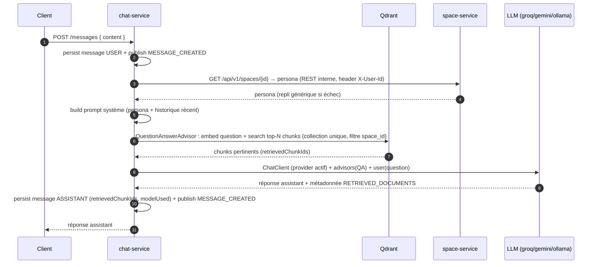

# chat-service

> **Statut :** 🟢 RAG câblé de bout en bout — validation e2e complète (infra + Ollama) restant à faire
> **Port :** `8084` · **Base :** `chat_db` (PostgreSQL) · **Vecteurs :** Qdrant (collection unique `chunks`) · **LLM :** Groq / Gemini / Ollama

Conversations, messages et **orchestration RAG** (Retrieval-Augmented Generation) **câblée** :
retrieval Qdrant via `QuestionAnswerAdvisor` (collection unique, filtre `space_id`), persona de
l'espace via `space-service`, et appel au LLM actif via `ChatProviderResolver` — avec
dégradation non bloquante à chaque étape. Il reste la **validation de bout en bout** (toute
l'infra + Ollama démarrés) et l'intégration **Gemini**.

## Rôle

1. Créer des conversations (rattachées à un espace) et lire l'historique.
2. Envoyer un message : construire la réponse de l'assistant en s'appuyant sur le contenu des
   documents indexés dans Qdrant (RAG) et le **persona** de l'espace.
3. Publier `MESSAGE_CREATED` pour **chaque** message (utilisateur **et** assistant) — c'est ce
   qui alimente `analytics-service`.

## Choix techniques

- **Modèle de messages typé** : `role` (`USER` / `ASSISTANT`), traçabilité RAG native
  (`retrieved_chunk_ids UUID[]` sur une colonne PostgreSQL, fidèle au schéma du contrat),
  `model_used`, `token_count`.
- **Retrieval via `QuestionAnswerAdvisor`** (module `spring-ai-advisors-vector-store`) sur le
  `QdrantVectorStore` auto-configuré (`spring-ai-starter-vector-store-qdrant`) — **Option A** :
  collection **unique** `chunks`, chaque point porte son `space_id` en payload, filtré au
  retrieval par `filterExpression("space_id == '…'")`. C'est Spring AI qui fusionne les chunks
  retrouvés dans le prompt ; les IDs réellement utilisés sont extraits de la métadonnée
  `QuestionAnswerAdvisor.RETRIEVED_DOCUMENTS` de la réponse (`retrieved_chunk_ids`).
- **Embedding** : même modèle qu'`ingestion-service` (`nomic-embed-text`) pour que les vecteurs
  indexés soient dans le même espace (propriété `spring.ai.ollama.embedding.options.model`).
- **Persona de l'espace** : appel REST service-à-service à `space-service`
  (`GET /api/v1/spaces/{id}`) via `SpaceClient` (RestClient). Les headers `X-User-Id` injectés
  par la gateway sont **reproduits en interne** avec le propriétaire de la conversation (contrat
  de sécurité : les backends font confiance aux headers, cf. `common/UserContextFilter`).
  Défaillance non bloquante : persona générique si space-service est injoignable.
- **Historique** : persisté en base (`messages` table) et **reconstruit dans le prompt système**
  (`CHAT_MAX_HISTORY_MESSAGES`) — pas de `MessageChatMemoryAdvisor`/`ChatMemory` en mémoire :
  la base reste la source de vérité unique, et l'historique est ainsi partagé/durable entre
  instances et redémarrages.
- **Bascule de provider LLM par configuration** : `ACTIVE_LLM_PROVIDER` ∈
  `groq | gemini | ollama` (via `LlmProviderConfig`).
  - **Groq** : API compatible OpenAI → le starter Spring AI **OpenAI** est pointé sur
    `https://api.groq.com/openai` (aucun SDK spécifique requis). Modèle par défaut
    `llama-3.3-70b-versatile`.
  - **Ollama** : fallback **100 % local / hors-ligne** (soutenance sans connexion).
    Modèle par défaut `qwen2.5:3b`.
  - **Gemini** : *non câblé* — voir « Point ouvert » ci-dessous.
- **`ChatProviderResolver`** : `current()` renvoie le `ChatClient` correspondant à
  `ACTIVE_LLM_PROVIDER` (repli non bloquant sur `ollama` si le provider configuré n'est pas
  enregistré).
- **Dégradation non bloquante** : échec LLM ou retrieval → réponse ASSISTANT dégradée persistée
  quand même ; la conversation n'est jamais cassée.
- **Paramètres de RAG configurables** : `CHAT_MAX_RETRIEVED_CHUNKS` (5),
  `CHAT_SIMILARITY_THRESHOLD` (0.7) et `CHAT_MAX_HISTORY_MESSAGES` (10).

## Orchestration RAG (implémentée)



Le mécanisme central (QdrantVectorStore + `filterExpression` `space_id`) a été validé par un
**smoke test contre un vrai conteneur Qdrant** : filtre espace → seuls les points de l'espace
sont retournés.

## Endpoints

Toutes les routes sont protégées par JWT ; l'accès à une conversation est restreint à son
propriétaire.

| Méthode | Route | Rôle | Description |
|---|---|---|---|
| POST | `/api/v1/conversations` | connecté | Créer une conversation (espace requis, titre optionnel) |
| GET | `/api/v1/conversations?spaceId={id}` | connecté | Lister **mes** conversations d'un espace |
| POST | `/api/v1/conversations/{id}/messages` | propriétaire | Envoyer un message → réponse RAG de l'assistant |
| GET | `/api/v1/conversations/{id}/messages` | propriétaire | Historique complet (ordre chronologique) |

## Règles métier

- **Seul le propriétaire** de la conversation peut y lire/écrire (`403` sinon).
- **Deux messages par tour** : un `USER` puis un `ASSISTANT`, chacun publié sur
  `chat.events`. `analytics-service` ne compte que les messages `USER` comme questions.
- `retrieved_chunk_ids` est rempli avec les IDs des chunks réellement utilisés (métadonnée
  `RETRIEVED_DOCUMENTS`) ; `model_used` avec le provider actif (ex. `ollama` / `groq`).
- Les messages sont horodatés et ordonnés par `created_at` (historique stable).

## Événements

| Canal | Événement | Direction | Rôle |
|---|---|---|---|
| `chat.events` | `MESSAGE_CREATED` | publié | Statistiques d'usage + détection de notions difficiles (analytics-service) |
| `space.events` | `SPACE_DELETED` | consommé | Purge des conversations de l'espace |
| `user.events` | `USER_DELETED` | consommé | Purge des conversations de l'utilisateur |

## Modèle de données

- `conversations` : `id`, `space_id` (logique), `user_id` (logique), `title`, horodatages.
- `messages` : `id`, `conversation_id (FK cascade)`, `role`, `content`, `retrieved_chunk_ids UUID[]`,
  `model_used`, `token_count`, `created_at`.

## Non implémenté (reste à faire pour le mémoire)

1. **Validation de bout en bout** avec toute l'infra (postgres + redis + qdrant + ollama +
   space-service) : envoyer un vrai message et vérifier la réponse basée sur les documents
   indexés.
2. Remplir `tokenCount` sur la réponse (non renseigné pour l'instant).
3. **Gemini** : voir « Point ouvert ».

**Point ouvert** : l'intégration **Gemini AI Studio** n'a pas de starter Spring AI officiel
identifié avec certitude (Spring AI propose `Vertex AI Gemini`, différent de l'API AI Studio à
clé simple). À choisir : starter Vertex AI, ou **seconde instance du starter OpenAI** (bean
`OpenAiApi`/`OpenAiChatModel` manuel pointé sur l'endpoint compatible Gemini, comme
`docling-worker`) à ajouter à la `Map` du `ChatProviderResolver`.

## Variables d'environnement

| Variable | Défaut | Rôle |
|---|---|---|
| `ACTIVE_LLM_PROVIDER` | `ollama` | `groq` \| `gemini` \| `ollama` |
| `GROQ_API_KEY` / `GROQ_MODEL` | — / `llama-3.3-70b-versatile` | Provider Groq (compatible OpenAI) |
| `OLLAMA_URL` / `OLLAMA_MODEL` | `http://localhost:11434` / `qwen2.5:3b` | Fallback local |
| `OLLAMA_EMBEDDING_MODEL` | `nomic-embed-text` | Modèle d'embedding (identique à ingestion-service) |
| `QDRANT_HOST` / `QDRANT_PORT` / `QDRANT_COLLECTION` | `localhost` / `6334` / `chunks` | Base vectorielle (collection unique) |
| `SPACE_SERVICE_URL` | `http://localhost:8082` | Persona de l'espace (appel service-à-service) |
| `CHAT_MAX_RETRIEVED_CHUNKS` | `5` | Nombre de chunks injectés dans le prompt |
| `CHAT_SIMILARITY_THRESHOLD` | `0.7` | Seuil de similarité minimal d'un chunk |
| `CHAT_MAX_HISTORY_MESSAGES` | `10` | Longueur d'historique conservée |

## Lancer

```bash
docker compose up -d postgres redis qdrant
mvn -pl common,chat-service -am spring-boot:run
# Swagger : http://localhost:8084/swagger-ui.html
# Sans clé API, choisir ollama (démarrer le profil ollama de docker-compose) ; space-service
# doit tourner pour récupérer le persona (repli générique sinon).
```
