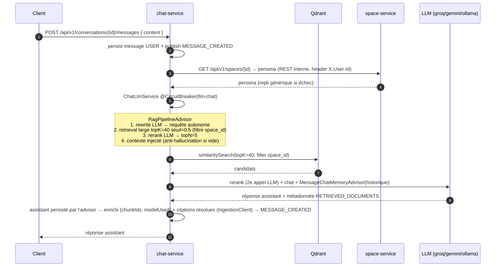

# chat-service

> **Statut :** 🟢 RAG câblé de bout en bout — validation e2e complète (infra + Ollama) restant à faire
> **Port :** `8084` · **Base :** `chat_db` (PostgreSQL) · **Vecteurs :** Qdrant (collection unique `chunks`) · **LLM :** Groq / Gemini / Ollama

Conversations, messages et **orchestration RAG** (Retrieval-Augmented Generation) **câblée** :
pipeline custom `RagPipelineAdvisor` (réécriture de requête → retrieval large filtré `space_id`
→ rerank LLM → contexte augmenté), persona de l'espace via `space-service`, historique via
`JpaBackedChatMemory` + `MessageChatMemoryAdvisor`, et appel au LLM actif via `ChatProviderResolver`
(`ai-common`) — le tout sous circuit breaker `llm-chat`. Il reste la **validation de bout en bout**
(toute l'infra + Ollama démarrés) et le test live **Gemini**.

## Rôle

1. Créer des conversations (rattachées à un espace) et lire l'historique.
2. Envoyer un message : construire la réponse de l'assistant en s'appuyant sur le contenu des
   documents indexés dans Qdrant (RAG) et le **persona** de l'espace.
3. Publier `MESSAGE_CREATED` pour **chaque** message (utilisateur **et** assistant) — c'est ce
   qui alimente `analytics-service`.

## Choix techniques

- **Modèle de messages typé** : `role` (`USER` / `ASSISTANT`), traçabilité RAG native
  (`retrieved_chunk_ids UUID[]` sur une colonne PostgreSQL, fidèle au schéma du contrat),
  `model_used`, `token_count`.
- **Content blocks structurés** : les blocs (`MARKDOWN`, `CODE`, `MERMAID`, `MATH_INLINE`,
  `MATH_DISPLAY`, `IMAGE`) sont calculés **à la volée** au moment de la lecture
  (`ResponseParser`) et **non persistés** en base — le champ `content` brut est la source
  de vérité. C'est le design voulu : permettre d'évoluer le parsing sans migration.
- **Pipeline RAG custom — `RagPipelineAdvisor`** (équivalent fonctionnel du RAG modulaire de
  Spring AI 2.0, absent en 1.1.x — cf. `ARCHITECTURE.md` §6.3). Le `QdrantVectorStore`
  auto-configuré (`spring-ai-starter-vector-store-qdrant`) — **Option A** : collection **unique**
  `chunks`, chaque point porte son `space_id` en payload, filtré au retrieval par
  `filterExpression("space_id == '…'")`. Le pipeline :
  1. **Rewrite** : la question brute est réécrite par LLM en requête de retrieval autonome
     (utile en multi-tour : « et pour le second cas ? » n'a pas de sens isolé). Échec = question brute.
  2. **Retrieval large** : `topK` élevé (`CHAT_RETRIEVAL_TOP_K` = 40) + seuil bas
     (`CHAT_RETRIEVAL_SIMILARITY_THRESHOLD` = 0.5), pour ne pas rater de chunk pertinent.
  3. **Rerank** : les candidats sont réordonnés par un second appel LLM
     (`LlmDocumentReranker`, tags `[C0]..[Cn]`), garde le `topN` = `CHAT_MAX_RETRIEVED_CHUNKS` (5).
     Échec = les `topN` premiers candidats.
  4. **Augmentation** : le contexte est injecté dans le prompt système. Contexte vide →
     **anti-hallucination** : le modèle répond honnêtement qu'il ne trouve pas l'information.
  Les IDs des chunks réellement utilisés sont exposés dans la métadonnée
  `rag_retrieved_documents` (clé posée par `RagPipelineAdvisor.RETRIEVED_DOCUMENTS`) de la
  réponse (`retrieved_chunk_ids`).
- **Embedding** : même modèle qu'`ingestion-service` (`nomic-embed-text`) pour que les vecteurs
  indexés soient dans le même espace (propriété `spring.ai.ollama.embedding.options.model`).
- **Persona de l'espace** : appel REST service-à-service à `space-service`
  (`GET /api/v1/spaces/{id}`) via `SpaceClient` (RestClient). Les headers `X-User-Id` et
  `X-Request-Id` injectés par la gateway en temps normal sont reproduits en interne avec
  l'identité du propriétaire. Défaillance non bloquante : persona générique si space-service
  est injoignable.
- **Noms de documents des citations** : appel REST service-à-service à `ingestion-service`
  (`GET /api/v1/documents/{id}`) via `IngestionClient`, même contrat de headers internes.
  Non bloquant : citation sans nom si ingestion est injoignable ou si le document appartient
  à un autre membre de l'espace (403). Config `ingestion-service.url`.
- **Historique — `JpaBackedChatMemory` + `MessageChatMemoryAdvisor`** : la base reste la source
  de vérité **unique** ; `JpaBackedChatMemory` implémente `ChatMemory` par-dessus
  `MessageRepository` (aucun store en mémoire Spring AI). `MessageChatMemoryAdvisor.before()`
  injecte l'historique (fenêtre `CHAT_MAX_HISTORY_MESSAGES`) dans le prompt et
  `after()` persiste les messages via le repository — `add()` est **idempotent** (un message
  dont le contenu correspond au dernier message du même rôle n'est pas ré-inséré), ce qui
  réconcilie la persistance par `ChatService` (message USER persisté **avant** l'appel,
  événement immédiat) et celle de l'advisor.
- **Bascule de provider LLM par configuration** : `ACTIVE_LLM_PROVIDER` ∈
  `groq | gemini | ollama` via `ai-common` (`LlmProviderAutoConfiguration` + `ChatProviderResolver`).
  - **Groq** : API compatible OpenAI → le starter Spring AI **OpenAI** est pointé sur
    `https://api.groq.com/openai` (aucun SDK spécifique requis). Modèle par défaut
    `openai/gpt-oss-120b` (catalogue Groq vérifié en août 2026, susceptible d'évoluer).
  - **Ollama** : fallback **100 % local / hors-ligne** (soutenance sans connexion).
    Modèle par défaut `qwen2.5:3b`.
  - **Gemini** : Google expose une **API compatible OpenAI officielle**
    (`https://generativelanguage.googleapis.com/v1beta/openai/`, clé AI Studio, noms de
    modèles Gemini) → même mécanisme que Groq (changement de base-url), mais le starter
    OpenAI ne permettant qu'**une** auto-configuration (déjà prise par Groq), le modèle est
    construit en **variable locale** d'un `@Bean` d'`ai-common` (`spring.ai.gemini.*`), sans
    déclarer de bean `OpenAiApi`/`OpenAiChatModel` (sinon l'auto-config Groq serait supprimée
    par son `@ConditionalOnMissingBean`).
- **`ChatProviderResolver`** : `current()` renvoie le `ChatClient` du provider actif ; lève
  `ApiException(LLM_PROVIDER_UNAVAILABLE, 503)` si le provider configuré n'est pas disponible
  (pas de repli silencieux — cf. `ARCHITECTURE.md` §6.3).
- **Circuit breaker `llm-chat`** : l'appel RAG+LLM est isolé dans `ChatLlmService`
  (`@CircuitBreaker`, composant séparé pour éviter l'auto-invocation AOP). En échec ou circuit
  ouvert → **message d'indisponibilité honnête** (« L'assistant est temporairement
  indisponible. Réessayez dans quelques instants. »), jamais une réponse statique trompeuse.
- **Paramètres de RAG configurables** : `CHAT_RETRIEVAL_TOP_K` (40), `CHAT_RETRIEVAL_SIMILARITY_THRESHOLD`
  (0.5), `CHAT_MAX_RETRIEVED_CHUNKS` (5) et `CHAT_MAX_HISTORY_MESSAGES` (10).

## Orchestration RAG (implémentée)



Le mécanisme central (QdrantVectorStore + `filterExpression` `space_id`) a été validé par un
**smoke test contre un vrai conteneur Qdrant** : filtre espace → seuls les points de l'espace
sont retournés.

## Endpoints

Toutes les routes sont protégées par JWT ; l'accès à une conversation est restreint à son
propriétaire.

| Méthode | Route | Rôle | Description |
|---|---|---|---|
| POST | `/api/v1/conversations` | connecté | Créer une conversation (espace requis, titre optionnel) |
| GET | `/api/v1/conversations?spaceId={id}` | connecté | Lister **mes** conversations d'un espace |
| POST | `/api/v1/conversations/{id}/messages` | propriétaire | Envoyer un message → réponse RAG de l'assistant |
| GET | `/api/v1/conversations/{id}/messages` | propriétaire | Historique complet (ordre chronologique) |

## Règles métier

- **Seul le propriétaire** de la conversation peut y lire/écrire (`403` sinon).
- **Deux messages par tour** : un `USER` puis un `ASSISTANT`, chacun publié sur
  `chat.events`. `analytics-service` ne compte que les messages `USER` comme questions.
- `retrieved_chunk_ids` est rempli avec les IDs des chunks réellement utilisés (métadonnée
  `RETRIEVED_DOCUMENTS`) ; `model_used` avec le provider actif (ex. `ollama` / `groq`).
- **Citations lisibles** : au moment de la génération, chaque chunk utilisé est résolu en
  `{chunkId, documentId, chunkIndex, documentName, excerpt}` (payload Qdrant + nom de
  fichier via `IngestionClient` → ingestion-service, appel non bloquant) et persisté en
  JSONB sur le message ASSISTANT. Une seule résolution à l'écriture, jamais d'appel réseau
  à la lecture. Messages antérieurs à la feature / fallback circuit breaker → liste vide,
  le front retombe sur les UUID bruts.
- Les messages sont horodatés et ordonnés par `created_at` (historique stable).

## Événements

| Canal | Événement | Direction | Rôle |
|---|---|---|---|
| `chat.events` | `MESSAGE_CREATED` | publié | Statistiques d'usage + détection de notions difficiles (analytics-service) |
| `space.events` | `SPACE_DELETED` | consommé | Purge des conversations de l'espace |
| `user.events` | `USER_DELETED` | consommé | Purge des conversations de l'utilisateur |

## Modèle de données

Migrations Flyway (`db/migration`) : `V1__init.sql`, `V2__message_citations.sql`.

- `conversations` : `id`, `space_id` (logique), `user_id` (logique), `title`, horodatages.
- `messages` : `id`, `conversation_id (FK cascade)`, `role`, `content`, `retrieved_chunk_ids UUID[]`,
  `citations JSONB`, `model_used`, `token_count`, `created_at`.

## Non implémenté (reste à faire pour le mémoire)

1. **Validation de bout en bout** avec toute l'infra (postgres + redis + qdrant + ollama +
   space-service) : envoyer un vrai message et vérifier la réponse basée sur les documents
   indexés, ainsi que la qualité du **rerank LLM** (paramètres à ajuster empiriquement).
2. Remplir `tokenCount` sur la réponse (V1 nullable, V2 tokenizer réel).
3. **Test live Gemini** : nécessite une `GEMINI_API_KEY` ; le câblage (endpoint compatible
   OpenAI + `completionsPath /chat/completions`) est vérifié à la compilation mais pas
   exécuté sans clé.

**Point ouvert** : aucune — les trois providers du contrat sont câblés. Seul un **test live
Gemini** (avec clé) reste à faire.

## Variables d'environnement

| Variable | Défaut | Rôle |
|---|---|---|
| `ACTIVE_LLM_PROVIDER` | `ollama` | `groq` \| `gemini` \| `ollama` |
| `GROQ_API_KEY` / `GROQ_MODEL` | — / `openai/gpt-oss-120b` | Provider Groq (compatible OpenAI) |
| `GEMINI_API_KEY` / `GEMINI_MODEL` | — / `gemini-2.5-flash` | Provider Gemini (endpoint OpenAI-compatible, `GEMINI_BASE_URL` surchargeable) |
| `OLLAMA_URL` / `OLLAMA_MODEL` | `http://localhost:11434` / `qwen2.5:3b` | Fallback local |
| `OLLAMA_EMBEDDING_MODEL` | `nomic-embed-text` | Modèle d'embedding (identique à ingestion-service) |
| `QDRANT_HOST` / `QDRANT_PORT` / `QDRANT_COLLECTION` | `localhost` / `6334` / `chunks` | Base vectorielle (collection unique) |
| `SPACE_SERVICE_URL` | `http://localhost:8082` | Persona de l'espace (appel service-à-service) |
| `CHAT_RETRIEVAL_TOP_K` | `40` | Nombre de candidats du retrieval large |
| `CHAT_RETRIEVAL_SIMILARITY_THRESHOLD` | `0.5` | Seuil de similarité minimal (phase retrieval large) |
| `CHAT_MAX_RETRIEVED_CHUNKS` | `5` | Nombre de chunks gardés après rerank (injectés dans le prompt) |
| `CHAT_MAX_HISTORY_MESSAGES` | `10` | Longueur d'historique conservée |

## Lancer

```bash
docker compose --profile ollama up -d postgres redis qdrant ollama
mvn -pl common,ai-common,chat-service -am spring-boot:run
# Swagger : http://localhost:8084/swagger-ui.html
# Sans clé API, choisir ollama (démarrer le profil ollama de docker-compose) ; space-service
# doit tourner pour récupérer le persona (repli générique sinon).
```
