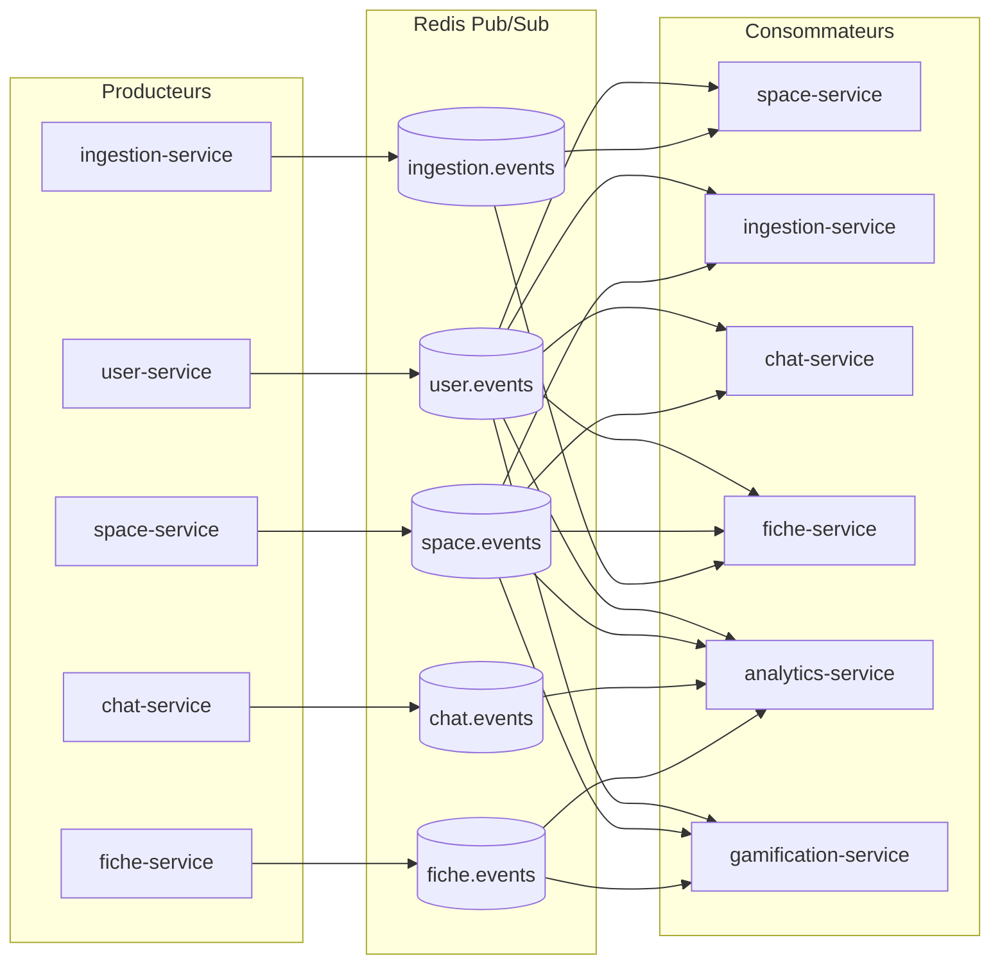

# common — Lib partagée

> **Statut :** ✅ Stable (infrastructure générique, aucune dépendance métier)

Module Maven **non exécutable** (`packaging: jar`, pas de `spring-boot-maven-plugin`) :
une bibliothèque consommée par les 8 modules applicatifs. Elle centralise tout ce qui
serait dupliqué d'un microservice à l'autre.

## Rôle

| Brique | Contenu |
|---|---|
| Enveloppe de réponse | `ApiResponse<T>` (`{ success, data\|error, meta }`), `ApiError`, `Meta` |
| Gestion d'erreurs | `GlobalExceptionHandler` (`@RestControllerAdvice`), hiérarchie `ApiException` + codes (`ErrorCode`) |
| Contexte utilisateur | Lecture des headers enrichis par la gateway (`UserContextFilter`, `UserContextHolder`, `UserContext`) |
| Messagerie | `RedisEventPublisher` (émission), `AbstractRedisEventListener` (consommation) |
| Contrat d'événements | Records `UserEvent`, `SpaceEvent`, `IngestionEvent`, `ChatEvent`, `FicheEvent` + noms de canaux `EventChannels` |

## Choix techniques

- **Un JAR partagé plutôt qu'un service réseau** : zéro latence et zéro point de
  défaillance supplémentaire, tout en évitant la duplication. (Détail dans `ARCHITECTURE.md` §4.)
- **Auto-configuration Spring Boot** : les classes de `common` vivent dans un package
  distinct (`mg.esmia.miage.common`) de celui de chaque service (`...userservice`, `...spaceservice`, etc.).
  Le scan de composants ne les verrait donc pas. L'enregistrement automatique passe par
  `META-INF/spring/org.springframework.boot.autoconfigure.AutoConfiguration.imports`
  (mécanisme standard depuis Spring Boot 2.7) :
  - `CommonAutoConfiguration` → `ObjectMapper` (avec module `JavaTimeModule`) + `UserContextFilter`.
  - `GlobalExceptionHandler` → importé directement via le même fichier.
- **Contexte par thread (ThreadLocal)** : `UserContextHolder` porte le contexte sur le
  thread de la requête. Les appels internes (jobs, listeners d'événements) n'ont pas de
  contexte → un contexte `SYSTEM` par défaut est renvoyé.
- **Messagerie brute JSON** : les événements sont sérialisés en JSON et publiés tels quels
  sur le canal Redis (pas de schéma de message, pas de lib de contrat externe — les records
  Java du module `common` SONT le contrat).
- **Idempotence exigée des consommateurs** : Redis Pub/Sub n'offre aucune garantie de
  livraison unique. Chaque `AbstractRedisEventListener` désérialise puis délègue à
  `onEvent(...)` que chaque service doit rendre idempotent.

## Contrat d'événements (canaux)

Tout producteur doit publier sur le canal du **service qui produit l'événement de domaine** ;
chaque consommateur s'abonne aux canaux qui l'intéressent.

| Canal | Événements | Producteur | Consommateurs |
|---|---|---|---|
| `user.events` | `USER_DELETED` | user-service | space, ingestion, chat, fiche, analytics, gamification |
| `space.events` | `SPACE_DELETED` | space-service | ingestion, chat, fiche, analytics, gamification |
| `ingestion.events` | `DOCUMENT_READY`, `DOCUMENT_FAILED` | ingestion-service | space (persona), fiche (obsolescence) |
| `chat.events` | `MESSAGE_CREATED` | chat-service | analytics |
| `fiche.events` | `FICHE_GENERATED`, `FICHE_VALIDATED` | fiche-service | analytics, gamification |



## Enveloppe de réponse uniforme

Contrat **non négociable** pour toutes les APIs du projet :

```json
// Succès
{ "success": true, "data": { ... }, "error": null, "meta": { "timestamp": "...", "requestId": "..." } }

// Erreur
{ "success": false, "data": null,
  "error": { "code": "RESOURCE_NOT_FOUND", "message": "...", "details": { } },
  "meta": { "timestamp": "...", "requestId": "..." } }
```

## Sécurité (contrat de confiance aux headers)

- La vérification du JWT a lieu **uniquement** à `api-gateway`.
- La gateway enrichit chaque requête sortante avec `X-User-Id`, `X-User-Role`, `X-Request-Id`.
- `UserContextFilter` lit ces headers ; les services backend font **confiance** à leur valeur
  et ne revalident jamais le token. `UserContext` expose des helpers : `isAdmin()` et `owns(...)`.

> ⚠️ Compromis assumé (voir `ARCHITECTURE.md` §2) : un service accédé directement hors
> gateway est vulnérable. C'est une limite connue, acceptable en développement local.

## Non implémenté / limites connues

- Aucune **vérification** que `X-User-Id` correspond réellement à un utilisateur existant
  côté service : les services ne consultent jamais `user-service` pour confirmer l'identité
  (volontaire, pour éviter les appels synchrones inter-services).
- `RedisEventPublisher` **ne garantit pas** la livraison : un échec de publication est
  uniquement journalisé (ne fait pas échouer la transaction métier). En cas de besoin de
  garantie, passer sur un broker avec `outbox pattern` — documenté comme extension possible.
- Les événements sont publiés **dans la transaction** du service producteur : si la
  transaction est rollback après publication, l'événement peut être « orphelin ».
