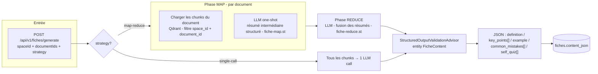
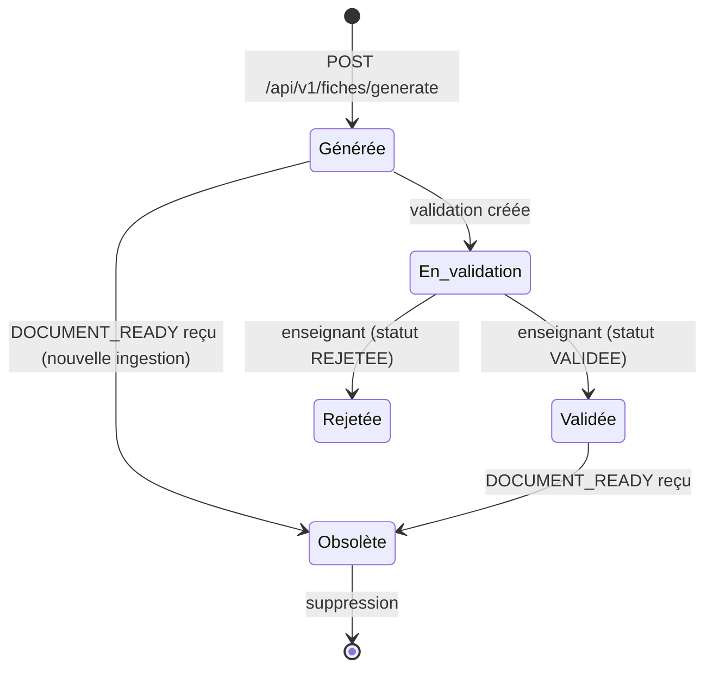

# fiche-service

> **Statut :** 🟢 CRUD complet + génération Map-Reduce + quiz implémentés (e2e à valider)
> **Port :** `8085` · **Base :** `fiche_db` (PostgreSQL) · **LLM :** Groq / Gemini / Ollama

Fiches de révision, quiz, partage, annotations et validation enseignant. Le CRUD complet
(fiches, partage, annotations, validation) est **fonctionnel** ; la **génération du contenu**
par le pattern **Map-Reduce** est implémentée dans `FicheGenerationService` (prompts
`fiche-map.st` / `fiche-reduce.st`, provider via `ai-common`, circuit breaker `llm-fiche`).
Le **sous-système quiz** (génération LLM ciblée, tentatives avec scoring, partage) est
également opérationnel (migration `V3__quiz.sql`, prompt `quiz-generate.st`).

## Rôle

### Fiches

1. **Générer** une fiche de révision à partir d'une liste de documents (sources indexées par
   ingestion-service) → contenu JSON structuré (`content_json`).
2. **Partager** une fiche à un destinataire ou à un groupe.
3. **Annoter** une fiche (notes rattachées à une section).
4. **Valider** une fiche (réservé aux enseignants) : `EN_ATTENTE / VALIDEE / REJETEE`.

### Quiz

5. **Générer** un quiz de révision ciblé (par document, par espace ou par topic), avec choix
   du niveau de difficulté et du nombre de questions → contenu JSON structuré (`questions[]`).
6. **Soumettre** des tentatives (réponses de l'étudiant) et obtenir un score.
7. **Partager** un quiz à un destinataire ou à un groupe.

## Choix techniques

### Contenu structuré

- **Contenu structuré en JSONB** : `content_json` (colonne PostgreSQL `jsonb`) porte une
  structure typée `{ definition, key_points[], example, common_mistakes[], self_quiz[] }`.
  Les champs `common_mistakes` (erreurs courantes à éviter) et `self_quiz` (questions
  d'auto-évaluation `{question, answer}`) sont générés par le prompt `fiche-reduce.st`.
  Le front peut rendre la fiche de façon déterministe.
- **Traçabilité des sources** : `source_document_ids UUID[]` (références logiques vers
  ingestion-service).

### Génération de fiches

- **Deux stratégies de génération** :
  - **Map-Reduce** (défaut) : pattern MAP → REDUCE avec `fiche-map.st` / `fiche-reduce.st`.
    Conforme au CDC §4.4.
  - **Single-call** : tous les chunks de tous les documents concaténés en un seul appel LLM.
    Plus simple, adapté aux petits corpus. Sélectionné par `strategy: "single-call"`.
- **Phase MAP** : pour chaque document, les chunks sont lus **directement dans Qdrant**
  (collection unique `chunks`, filtre `space_id` + `document_id` en payload) puis un résumé
  intermédiaire structuré est produit par un appel LLM one-shot (`fiche-map.st`). Liste
  vide = un MAP sur tout le corpus de l'espace.
- **Phase REDUCE** : fusion des résumés en une fiche unique cohérente, **validée structurellement**
  par `StructuredOutputValidationAdvisor` (3 tentatives max) + `entity(FicheContent.class)`
  (`fiche-reduce.st`).
- **Cache MAP Redis** (`FicheMapCacheService`) : les résumés intermédiaires de la phase MAP
  sont mis en cache (clé `fiche:map:{spaceId}:{documentId}`, TTL 24h configurable via
  `fiche.map-cache-ttl-hours`). Le cache est invalidé à chaque `DOCUMENT_READY` pour
  l'espace concerné. Partagé entre fiches et quiz.
- Résilience : circuit breaker `llm-fiche` → en échec, erreur métier 503 (pas de fiche
  placeholder trompeuse).

### Quiz

- **Génération single-call** : tous les chunks concaténés en un seul appel LLM
  (`quiz-generate.st`). Types de questions : QCM (4 options) et VRAI_FAUX (2 options).
- **Scoring** : comparaison cas-insensitive des réponses de l'étudiant contre les bonnes
  réponses (`QuizGenerationService.scoreAttempt()`).
- **Scope** : `DOCUMENT` (par document), `SPACE` (tout l'espace), `TOPIC` (thème libre).
- **Difficulté** : `FACILE`, `MOYEN`, `DIFFICILE` (contrôle la consigne dans le prompt).

### Cycle de vie

- **Obsolescence automatique** : à chaque `DOCUMENT_READY` reçu pour un espace, toutes les
  fiches **et quiz** existants de cet espace sont marqués `obsolete = true`.
- **Validation = 1 fiche ↔ 1 validation** : `validation_fiche.fiche_id` est `UNIQUE`
  (une nouvelle validation écrase la précédente — upsert).
- **Partage orienté** : `groupeId` **OU** `destinataireId` (un seul des deux, validé métier).

## Génération de fiche (stratégies Map-Reduce / Single-call)



## Cycle de vie d'une fiche



## Endpoints

Toutes les routes sont protégées par JWT.

### Fiches

| Méthode | Route | Rôle | Description |
|---|---|---|---|
| POST | `/api/v1/fiches/generate` | connecté | Générer une fiche (spaceId, documentIds?, title?, strategy?) |
| GET | `/api/v1/fiches?spaceId={id}` | connecté | Lister **mes** fiches d'un espace |
| GET | `/api/v1/fiches/mine` | connecté | Vue transverse : toutes mes fiches, tous espaces |
| GET | `/api/v1/fiches/espace/{spaceId}` | enseignant (admin) | Toutes les fiches d'un espace (file de validation) |
| GET | `/api/v1/fiches/{id}` | propriétaire/admin | Détail d'une fiche |
| DELETE | `/api/v1/fiches/{id}` | propriétaire/admin | Supprimer (cascade partages/annotations/validation) |
| POST | `/api/v1/fiches/{id}/share` | propriétaire | Partager à un groupe ou un destinataire |
| GET | `/api/v1/fiches/{id}/share` | connecté | Lister les partages |
| POST | `/api/v1/fiches/{ficheId}/annotations` | connecté | Ajouter une annotation (sectionRef optionnelle) |
| GET | `/api/v1/fiches/{ficheId}/annotations` | connecté | Lister les annotations |
| PUT | `/api/v1/fiches/{ficheId}/validation` | enseignant (admin) | Valider/rejeter (statut + commentaire) |
| GET | `/api/v1/fiches/{ficheId}/validation` | connecté | Lire la validation (défaut `EN_ATTENTE`) |

### Quiz

| Méthode | Route | Rôle | Description |
|---|---|---|---|
| POST | `/api/v1/quizzes/generate` | connecté | Générer un quiz (spaceId, scope, difficulty, questionCount) |
| GET | `/api/v1/quizzes?spaceId={id}` | connecté | Lister **mes** quiz d'un espace |
| GET | `/api/v1/quizzes/mine` | connecté | Vue transverse : tous mes quiz, tous espaces |
| GET | `/api/v1/quizzes/espace/{spaceId}` | enseignant (admin) | Tous les quiz d'un espace (file de validation) |
| GET | `/api/v1/quizzes/{id}` | propriétaire/admin | Détail d'un quiz |
| DELETE | `/api/v1/quizzes/{id}` | propriétaire/admin | Supprimer (cascade tentatives/partages) |
| POST | `/api/v1/quizzes/{id}/share` | propriétaire | Partager à un groupe ou un destinataire |
| GET | `/api/v1/quizzes/{id}/share` | connecté | Lister les partages |
| POST | `/api/v1/quizzes/{id}/attempts` | connecté | Soumettre une tentative (answersJson) |
| GET | `/api/v1/quizzes/{id}/attempts/mine` | connecté | Mes tentatives pour un quiz |
| GET | `/api/v1/quizzes/{id}/attempts/stats` | connecté | Statistiques de toutes les tentatives |

## Règles métier

### Fiches

- **Lecture/suppression** : propriétaire ou admin. **Partage** : propriétaire uniquement (`isAdmin=false` codé en dur dans `ShareService`).
- **Seul un enseignant** (`ADMIN`/`ENSEIGNANT` au sens `UserContext.isAdmin()`) peut valider
  → `403` sinon.
- **Partage** : fournir `groupeId` **ou** `destinataireId`, jamais les deux ni aucun → `400`.
- **Obsolescence** : toute nouvelle ingestion dans l'espace rend les fiches **et quiz** existants obsolètes.
- **Validation unique** : revalider une fiche remplace la validation précédente.
- **Rejet motivé** : `REJETEE` sans commentaire (null, vide ou blank) → `400 BAD_REQUEST`
  (`Commentaire obligatoire pour un rejet`) ; commentaire limité à 2000 caractères (`@Size`).
- La suppression d'une fiche supprime en cascade partages, annotations et validation (FK).

### Quiz

- **Lecture/suppression** : propriétaire ou admin.
- **Génération** : défaut BROUILLON (statut explicite `BROUILLON` ou `PUBLIE` accepté).
- **Publication** (`POST /api/v1/quizzes/{id}/publish` ou équivalent) : réservée enseignant
  (`ADMIN`/`ENSEIGNANT` au sens `UserContext.isAdmin()`) → `403` sinon. Idempotente si déjà
  `PUBLIE`, `400` si statut inattendu (ni `BROUILLON` ni `PUBLIE`).
- **Tentative** (`POST /api/v1/quizzes/{id}/attempts`) : `400` si quiz `BROUILLON`
  (« Quiz non publié »). Code 400 volontaire (état, pas droits ; l'invisibilité `BROUILLON`
  est assurée par `getById` owner/admin + filtre front).
- **Partage** : propriétaire uniquement.
 - **Scope** : `DOCUMENT` (chunks d'un document), `SPACE` (tous les chunks de l'espace), `TOPIC` (thème libre → targetTopic requis).
- **TOPIC** → `targetTopic` requis (3-120 car.) : filtré par consigne LLM (`{{TOPIC}}` dans `quiz-generate.st`), retrieval = espace seul (pas d'embedding).
- **Scoring** : comparaison exacte (insensible à la casse) entre `answer` et `correct_answer`.
- La suppression d'un quiz supprime en cascade tentatives et partages (FK).

## Événements

| Canal | Événement | Direction | Rôle |
|---|---|---|---|
| `fiche.events` | `FICHE_GENERATED` | publié | Progression étudiant (analytics) + suivi hebdo/badges (gamification) |
| `fiche.events` | `FICHE_VALIDATED` | publié | Progression (analytics) + badge validation (gamification) |
| `ingestion.events` | `DOCUMENT_READY` | consommé | Marquage obsolescence des fiches **et quiz** de l'espace + invalidation du cache MAP |
| `space.events` | `SPACE_DELETED` | consommé | Purge des fiches **et quiz** de l'espace |
| `user.events` | `USER_DELETED` | consommé | Purge des fiches **et quiz** de l'utilisateur |

> **Note** : aucun événement n'est publié pour les quiz (pas de `QUIZ_GENERATED`).
> Les quiz ne sont donc pas encore visibles dans les dashboards analytics ni les badges gamification.

## Modèle de données

### Fiches (V1 + V2)

- `fiches` : `id`, `space_id` (logique), `user_id` (logique), `title`, `source_document_ids UUID[]`,
  `content_json JSONB`, `obsolete`, `generated_at`, `updated_at`.
- `partage_fiche` : `id`, `fiche_id (FK cascade)`, `groupe_id` (nullable), `destinataire_id` (nullable),
  `partage_par`, `shared_at`.
- `annotations` : `id`, `fiche_id (FK cascade)`, `auteur_id` (logique), `contenu`, `section_ref`, `created_at`.
- `validation_fiche` : `id`, `fiche_id (FK cascade, UNIQUE)`, `enseignant_id`, `statut`, `commentaire`, `validated_at`.

### Quiz (V3)

- `quizzes` : `id` (UUID PK), `space_id`, `user_id`, `title` (nullable), `scope` (DOCUMENT/SPACE/TOPIC),
  `target_document_id` (nullable), `target_topic` (nullable), `source_fiche_id` (nullable),
  `source_document_ids UUID[]`, `difficulty` (FACILE/MOYEN/DIFFICILE), `question_count`,
  `content_json JSONB`, `obsolete`, `generated_at`, `updated_at`.
- `quiz_attempts` : `id` (UUID PK), `quiz_id (FK cascade)`, `user_id`, `answers_json JSONB`,
  `score`, `total_questions`, `attempted_at`.
- `quiz_shares` : `id` (UUID PK), `quiz_id (FK cascade)`, `groupe_id` (nullable),
  `destinataire_id` (nullable), `partage_par`, `shared_at`.

### Contenu structuré

**FicheContent** (`content_json`) :
```json
{
  "definition": "...",
  "key_points": ["...", "..."],
  "example": "...",
  "common_mistakes": ["...", "..."],
  "self_quiz": [{"question": "...", "answer": "..."}]
}
```

**Quiz content** (`content_json`) :
```json
{
  "questions": [
    {"type": "QCM", "question": "...", "options": ["A","B","C","D"], "answer": "B", "explanation": "..."},
    {"type": "VRAI_FAUX", "question": "...", "options": ["Vrai","Faux"], "answer": "Vrai", "explanation": "..."}
  ]
}
```

## Cœur IA

### `FicheGenerationService`

- **MAP** : pour chaque document, lecture des chunks **depuis Qdrant** (filtre `space_id` +
  `document_id` en payload, seuil 0 + requête neutre pour récupérer le contenu sans dépendre
  de la pertinence, plafond `FICHE_MAX_CHUNKS_PER_DOCUMENT` = 50) puis **résumé intermédiaire
  structuré** par appel LLM one-shot (`fiche-map.st`). DocumentIds vide = un MAP sur tout le
  corpus de l'espace (filtre `space_id` seul).
- **REDUCE** : fusion des résumés en une **fiche unique cohérente** (`fiche-reduce.st`),
  structure `definition / key_points / example / common_mistakes / self_quiz` garantie par
  `StructuredOutputValidationAdvisor` + `entity(FicheContent.class)`, sérialisée en JSON pour
  `content_json`.
- **Single-call** (alternative) : tous les chunks de tous les documents concaténés en un seul
  appel LLM. Moins coûteux en appels mais adapté aux petits corpus.
- Provider LLM : bascule par `ACTIVE_LLM_PROVIDER` (Groq / Gemini / Ollama via `ai-common`),
  circuit breaker `llm-fiche` → en échec, `ApiException` 503 (génération à relancer).

### `QuizGenerationService`

- Génération **single-call** : tous les chunks (tous documents de l'espace ou document ciblé)
  concaténés dans un seul prompt (`quiz-generate.st`).
- Types de questions : QCM (4 options) et VRAI_FAUX (2 options). Les distractors du QCM
  doivent être plausibles.
- Scoring : `scoreAttempt()` compare les réponses de l'étudiant aux bonnes réponses
  (comparaison exacte, insensible à la casse).

### `FicheMapCacheService`

- Cache Redis des résumés intermédiaires MAP (clé `fiche:map:{spaceId}:{documentId}`, TTL 24h).
- Invalidation : `invalidateSpace(spaceId)` à chaque `DOCUMENT_READY`.
- Partagé entre `FicheGenerationService` et `QuizGenerationService`.

## Variables d'environnement

| Variable | Défaut | Rôle |
|---|---|---|
| `SERVER_PORT` | `8085` | Port d'écoute |
| `DB_URL` | `jdbc:postgresql://localhost:5432/fiche_db` | URL de connexion PostgreSQL |
| `DB_USERNAME` / `DB_PASSWORD` | `postgres` / `postgres` | Identifiants BDD |
| `REDIS_HOST` / `REDIS_PORT` | `localhost` / `6379` | Redis (cache MAP + pub/sub) |
| `ACTIVE_LLM_PROVIDER` | `ollama` | `groq` \| `gemini` \| `ollama` |
| `GROQ_API_KEY` / `GROQ_MODEL` | — / `openai/gpt-oss-120b` | Provider Groq (compatible OpenAI) |
| `GROQ_BASE_URL` | `https://api.groq.com/openai` | URL de base Groq |
| `GEMINI_API_KEY` / `GEMINI_MODEL` | — / `gemini-2.5-flash` | Provider Gemini (endpoint OpenAI-compatible) |
| `GEMINI_BASE_URL` | `https://generativelanguage.googleapis.com/v1beta/openai` | URL de base Gemini |
| `OLLAMA_URL` / `OLLAMA_MODEL` | `http://localhost:11434` / `qwen2.5:3b` | LLM de génération (fallback local) |
| `OLLAMA_EMBEDDING_MODEL` | `nomic-embed-text` | Modèle d'embedding (identique à ingestion-service) |
| `QDRANT_HOST` / `QDRANT_PORT` / `QDRANT_COLLECTION` | `localhost` / `6334` / `chunks` | Lecture des chunks (phase MAP) |
| `QDRANT_USE_TLS` | `false` | TLS pour Qdrant |
| `FICHE_MAX_CHUNKS_PER_DOCUMENT` | `50` | Plafond de chunks lus par document |
| `fiche.map-cache-ttl-hours` | `24` | TTL du cache MAP Redis (heures) |

## Lancer

```bash
docker compose --profile ollama up -d postgres redis qdrant ollama
mvn -pl common,ai-common,fiche-service -am spring-boot:run
# Swagger : http://localhost:8085/swagger-ui.html
```

Le sous-système quiz est inclus dans ce même service (même base `fiche_db`, même port `8085`).
Aucune configuration supplémentaire n'est nécessaire.
