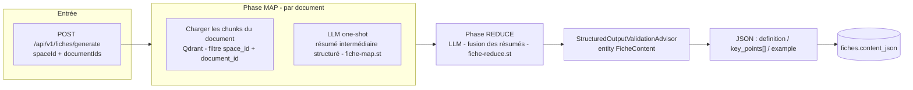
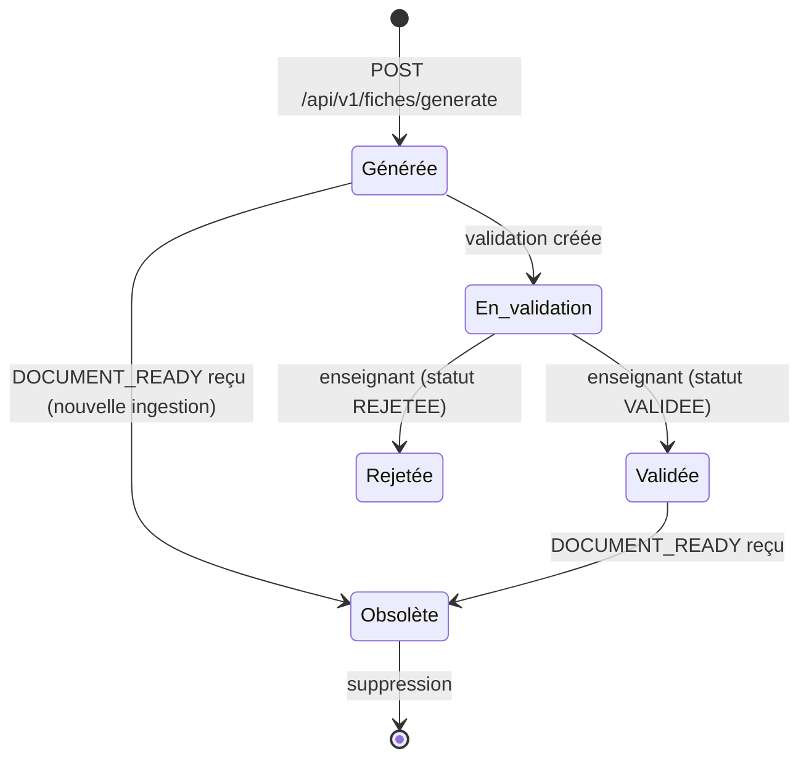

# fiche-service

> **Statut :** 🟢 CRUD complet + génération Map-Reduce implémentée (e2e à valider)
> **Port :** `8085` · **Base :** `fiche_db` (PostgreSQL) · **LLM :** Groq / Gemini / Ollama

Fiches de révision, partage, annotations et validation enseignant. Le CRUD complet
(fiches, partage, annotations, validation) est **fonctionnel** ; la **génération du contenu**
par le pattern **Map-Reduce** est implémentée dans `FicheGenerationService` (prompts
`fiche-map.st` / `fiche-reduce.st`, provider via `ai-common`, circuit breaker `llm-fiche`).

## Rôle

1. **Générer** une fiche de révision à partir d'une liste de documents (sources indexées par
   ingestion-service) → contenu JSON structuré (`content_json`).
2. **Partager** une fiche à un destinataire ou à un groupe.
3. **Annoter** une fiche (notes rattachées à une section).
4. **Valider** une fiche (réservé aux enseignants) : `EN_ATTENTE / VALIDEE / REJETEE`.

## Choix techniques

- **Contenu structuré en JSONB** : `content_json` (colonne PostgreSQL `jsonb`) porte une
  structure typée `{ definition, key_points[], example }` (cf. « Base de projet », sections
  `definition` / `key_points` / `example`). Le front peut donc rendre la fiche de façon
  déterministe.
- **Traçabilité des sources** : `source_document_ids UUID[]` (références logiques vers
  ingestion-service).
- **Génération par pattern Map-Reduce** (conforme CDC §4.4) :
  - **MAP** : pour chaque document, les chunks sont lus **directement dans Qdrant** (collection
    unique `chunks`, filtre `space_id` + `document_id` en payload) puis un résumé intermédiaire
    structuré est produit par un appel LLM one-shot (`fiche-map.st`). Liste vide = un MAP sur
    tout le corpus de l'espace.
  - **REDUCE** : fusion des résumés en une fiche unique cohérente, **validée structurellement**
    par `StructuredOutputValidationAdvisor` (3 tentatives max) + `entity(FicheContent.class)`
    (`fiche-reduce.st`).
  - Résilience : circuit breaker `llm-fiche` → en échec, erreur métier 503 (pas de fiche
    placeholder trompeuse).
- **Obsolescence automatique** : à chaque `DOCUMENT_READY` reçu pour un espace, toutes les
  fiches existantes de cet espace sont marquées `obsolete = true` (une fiche ne peut pas être
  à jour si un nouveau document a été ingéré après sa génération).
- **Validation = 1 fiche ↔ 1 validation** : `validation_fiche.fiche_id` est `UNIQUE`
  (une nouvelle validation écrase la précédente — upsert).
- **Partage orienté** : `groupeId` **OU** `destinataireId` (un seul des deux, validé métier).

## Génération de fiche (pattern Map-Reduce)



## Cycle de vie d'une fiche



## Endpoints

Toutes les routes sont protégées par JWT.

| Méthode | Route | Rôle | Description |
|---|---|---|---|
| POST | `/api/v1/fiches/generate` | connecté | Générer une fiche (spaceId + documentIds) |
| GET | `/api/v1/fiches?spaceId={id}` | connecté | Lister **mes** fiches d'un espace |
| GET | `/api/v1/fiches/{id}` | propriétaire/admin | Détail d'une fiche |
| DELETE | `/api/v1/fiches/{id}` | propriétaire/admin | Supprimer (cascade partages/annotations/validation) |
| POST | `/api/v1/fiches/{id}/share` | propriétaire | Partager à un groupe ou un destinataire |
| GET | `/api/v1/fiches/{id}/share` | connecté | Lister les partages |
| POST | `/api/v1/fiches/{id}/annotations` | connecté | Ajouter une annotation (sectionRef optionnelle) |
| GET | `/api/v1/fiches/{id}/annotations` | connecté | Lister les annotations |
| PUT | `/api/v1/fiches/{id}/validation` | enseignant (admin) | Valider/rejeter (statut + commentaire) |
| GET | `/api/v1/fiches/{id}/validation` | connecté | Lire la validation (défaut `EN_ATTENTE`) |

## Règles métier

- **Seul le propriétaire** (ou admin) peut lire/supprimer/partager une fiche.
- **Seul un enseignant** (`ADMIN`/`ENSEIGNANT` au sens `UserContext.isAdmin()`) peut valider
  → `403` sinon.
- **Partage** : fournir `groupeId` **ou** `destinataireId`, jamais les deux ni aucun → `400`.
- **Obsolescence** : toute nouvelle ingestion dans l'espace rend les fiches existantes obsolètes.
- **Validation unique** : revalider une fiche remplace la validation précédente.
- La suppression d'une fiche supprime en cascade partages, annotations et validation (FK).

## Événements

| Canal | Événement | Direction | Rôle |
|---|---|---|---|
| `fiche.events` | `FICHE_GENERATED` | publié | Progression étudiant (analytics) + suivi hebdo/badges (gamification) |
| `fiche.events` | `FICHE_VALIDATED` | publié | Progression (analytics) + badge validation (gamification) |
| `ingestion.events` | `DOCUMENT_READY` | consommé | Marquage obsolescence des fiches de l'espace |
| `space.events` | `SPACE_DELETED` | consommé | Purge des fiches de l'espace |
| `user.events` | `USER_DELETED` | consommé | Purge des fiches de l'utilisateur |

## Modèle de données

- `fiches` : `id`, `space_id` (logique), `user_id` (logique), `title`, `source_document_ids UUID[]`,
  `content_json JSONB`, `obsolete`, `generated_at`, `updated_at`.
- `partage_fiche` : `id`, `fiche_id (FK cascade)`, `groupe_id` (nullable), `destinataire_id` (nullable),
  `partage_par`, `shared_at`.
- `annotations` : `id`, `fiche_id (FK cascade)`, `auteur_id` (logique), `contenu`, `section_ref`, `created_at`.
- `validation_fiche` : `id`, `fiche_id (FK cascade, UNIQUE)`, `enseignant_id`, `statut`, `commentaire`, `validated_at`.

## Cœur IA : `FicheGenerationService`

- **MAP** : pour chaque document, lecture des chunks **depuis Qdrant** (filtre `space_id` +
  `document_id` en payload, seuil 0 + requête neutre pour récupérer le contenu sans dépendre
  de la pertinence, plafond `FICHE_MAX_CHUNKS_PER_DOCUMENT` = 50) puis **résumé intermédiaire
  structuré** par appel LLM one-shot (`fiche-map.st`). DocumentIds vide = un MAP sur tout le
  corpus de l'espace (filtre `space_id` seul).
- **REDUCE** : fusion des résumés en une **fiche unique cohérente** (`fiche-reduce.st`),
  structure `definition / key_points / example` garantie par
  `StructuredOutputValidationAdvisor` + `entity(FicheContent.class)`, sérialisée en JSON pour
  `content_json`.
- Provider LLM : bascule par `ACTIVE_LLM_PROVIDER` (Groq / Gemini / Ollama via `ai-common`),
  circuit breaker `llm-fiche` → en échec, `ApiException` 503 (génération à relancer).

## Variables d'environnement

| Variable | Défaut | Rôle |
|---|---|---|
| `ACTIVE_LLM_PROVIDER` | `ollama` | `groq` \| `gemini` \| `ollama` |
| `GROQ_API_KEY` / `GROQ_MODEL` | — / `llama-3.3-70b-versatile` | Provider Groq (compatible OpenAI) |
| `GEMINI_API_KEY` / `GEMINI_MODEL` | — / `gemini-2.5-flash` | Provider Gemini (endpoint OpenAI-compatible) |
| `OLLAMA_URL` / `OLLAMA_MODEL` | `http://localhost:11434` / `qwen2.5:3b` | LLM de génération (fallback local) |
| `OLLAMA_EMBEDDING_MODEL` | `nomic-embed-text` | Modèle d'embedding (identique à ingestion-service) |
| `QDRANT_HOST` / `QDRANT_PORT` / `QDRANT_COLLECTION` | `localhost` / `6334` / `chunks` | Lecture des chunks (phase MAP) |
| `FICHE_MAX_CHUNKS_PER_DOCUMENT` | `50` | Plafond de chunks lus par document |

## Lancer

```bash
docker compose --profile ollama up -d postgres redis qdrant ollama
mvn -pl common,ai-common,fiche-service -am spring-boot:run
# Swagger : http://localhost:8085/swagger-ui.html
```
