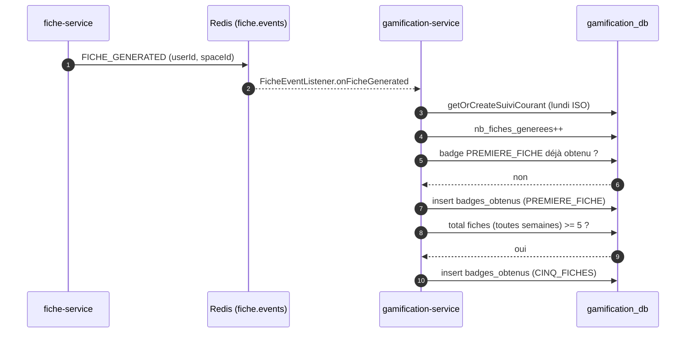

# gamification-service

> **Statut :** ✅ Complet (livraison des rappels : à brancher)
> **Port :** `8087` · **Base :** `gamification_db` (PostgreSQL)
> **Nature :** service **consommateur** d'événements uniquement — ne publie aucun événement.

Objectifs de révision, badges, suivi hebdomadaire et rappels. Alimenté par consommation
de `fiche.events` (badges) et par les événements de nettoyage (`space.events`, `user.events`).
Implémentation **complète** — sauf la **livraison effective** des rappels (voir plus bas).

## Rôle

- **Objectifs de révision** : créer/suivre des objectifs (statuts `EN_COURS / ATTEINT / ABANDONNE`),
  avec échéance ; marquer un objectif atteint déclenche badge + suivi hebdo.
- **Badges** : catalogue seedé en base (`V2__seed_badges.sql`), attribués **une seule fois**
  par utilisateur, avec statut « obtenu » dans le catalogue renvoyé au front.
- **Suivi hebdomadaire** : compteurs par (utilisateur, espace, semaine) — clé = **lundi** ISO.
- **Rappels** : un job planifié détecte les rappels arrivés à échéance et les marque « envoyé ».

## Choix techniques

- **Données de référence en migration** : le catalogue de badges vit dans
  `V2__seed_badges.sql` ; `BadgeCode.java` est la clé **stable** utilisée par le code
  (`PREMIERE_FICHE`, `CINQ_FICHES`, `PREMIERE_FICHE_VALIDEE`, `PREMIER_OBJECTIF_ATTEINT`).
  ⚠️ Les deux doivent rester synchronisés.
- **Attribution idempotente** : `UNIQUE(user_id, badge_id)` en base + vérification
  `existsByUserIdAndBadgeId` avant insertion → un badge n'est jamais attribué deux fois,
  même si l'événement arrive en double.
- **Suivi hebdo clé par lundi** (`LocalDate.now().with(previousOrSame(MONDAY))`) : la semaine
  courante est la ligne dont `semaine_debut = lundi`. `UNIQUE(user_id, space_id, semaine_debut)`.
- **Job de rappels planifié** : `@EnableScheduling` + `@Scheduled(fixedDelayString)` (toutes les
  5 min, configurable). Requête `envoye=false AND prevu_le < now()` → marque `envoye=true`.
- **Badge `CINQ_FICHES` via cumul hebdo** : somme des `nb_fiches_generees` de **toutes** les
  semaines de l'utilisateur dans l'espace ≥ 5.
- **Canal unique `fiche.events`** : `FicheEventListener` dispatche sur `JsonNode` (champ
  `event`, payloads `FicheEvent` / `QuizEvent` common) ; les types `QUIZ_*` sont ignorés
  (aucune règle badge), payload incomplet → warn + ignoré.

## Flux d'attribution des badges



## Endpoints

Toutes les routes sont protégées par JWT.

| Méthode | Route | Rôle | Description |
|---|---|---|---|
| POST | `/api/v1/objectifs` | connecté | Créer un objectif (espace, titre, description, échéance) |
| GET | `/api/v1/objectifs?spaceId={id}` | connecté | Lister **mes** objectifs d'un espace |
| PATCH | `/api/v1/objectifs/{id}` | propriétaire | Mettre à jour le statut (`ATTEINT` → badge + suivi) |
| GET | `/api/v1/badges` | connecté | Catalogue complet avec indicateur « obtenu » |
| POST | `/api/v1/rappels` | connecté | Créer un rappel (espace, message, `prevuLe`) |
| GET | `/api/v1/rappels` | connecté | Lister **mes** rappels |
| DELETE | `/api/v1/rappels/{id}` | propriétaire | Supprimer un rappel |

## Règles métier

- **Accès restreint** : un objectif/rappel n'est modifiable/supprimable que par son
  propriétaire (`403` sinon).
- **Badges une seule fois** : `UNIQUE(user_id, badge_id)` + vérification pré-insertion.
- **Objectif atteint** : `updateStatut(ATTEINT)` incrémente `nb_objectifs_atteints` de la
  semaine courante et attribue `PREMIER_OBJECTIF_ATTEINT`.
- **`PREMIERE_FICHE_VALIDEE` attribué si enrichi** : `onFicheValidated(userId, enseignantId,
  statut)` impute le badge à l'**auteur de la fiche** (`userId` de l'événement
  `FICHE_VALIDATED` enrichi, publish-after-commit côté fiche-service) quand `statut =
  VALIDEE` ; sans `userId` (contrat historique) → no-op loggé. Idempotent via
  `existsByUserIdAndBadgeId` + `UNIQUE(user_id, badge_id)`.
- **Rappel** : le job ne fait que **marquer envoyé** ; aucune notification réelle n'est envoyée.

## Modèle de données

- `objectif_revision` : `user_id`, `space_id`, `titre`, `description`, `date_echeance`, `statut`.
- `badges` : `code (UNIQUE)`, `nom`, `description`, `icone` — catalogués par `V2__seed_badges.sql`.
- `badges_obtenus` : `user_id`, `badge_id (FK cascade)`, `obtenu_le`, `UNIQUE(user_id, badge_id)`.
- `suivi_hebdomadaire` : `user_id`, `space_id`, `semaine_debut (lundi)`, `nb_fiches_generees`,
  `nb_objectifs_atteints`, `UNIQUE(user_id, space_id, semaine_debut)`.
- `rappels` : `user_id`, `space_id` (nullable), `message`, `prevu_le`, `envoye`.

## Non implémenté / limites connues

- **Livraison des rappels** : le job (`processDueReminders`) marque les rappels `envoye=true`
  et journalise, mais **aucune notification réelle** n'est envoyée — ni email, ni push, ni SMS.
  Le service ne contient aucun canal de livraison de notifications. Brancher un vrai canal
  est une extension non bloquante.
- **`PREMIERE_FICHE_VALIDEE`** : attribué à l'**auteur de la fiche** (`userId` de
  l'événement `FICHE_VALIDATED` enrichi désormais publié côté fiche-service,
  publish-after-commit) quand le statut est `VALIDEE`. Sans `userId` (contrat historique :
  l'événement ne portait que `enseignantId`), `onFicheValidated` se contente de journaliser
  (no-op). Surcharge historique conservée `@Deprecated`.
- **Nettoyage des rappels** : `RappelRepository` possède `deleteBySpaceId` et
  `deleteByUserId`, mais ces méthodes n'étaient historiquement pas appelées lors de la
  suppression d'un espace ou d'un utilisateur — les rappels orphelins restaient en base.
  **Corrigé** : les deux méthodes sont désormais invoquées dans `deleteAllForSpace` /
  `deleteAllForUser`.
- **Pas de déduplication explicite des événements** : dispatch `JsonNode` tolérant (champ
  `event`), idempotence via contraintes `UNIQUE` (badges) ; les compteurs hebdo sont
  rejoués (+1) en cas de redélivrance `FICHE_GENERATED` (at-least-once). À durcir via Set
  Redis (TODO commenté : clé `ficheId` `gamification:dedup:fiche:<ficheId>`, SETNX + TTL).

## Événements consommés

| Canal | Événement | Impact |
|---|---|---|
| `fiche.events` | `FICHE_GENERATED` | +1 suivi hebdo + badges `PREMIERE_FICHE` / `CINQ_FICHES` |
| `fiche.events` | `FICHE_VALIDATED` | Badge `PREMIERE_FICHE_VALIDEE` à l'auteur (`userId` enrichi, `VALIDEE`) ; no-op loggé sans `userId` |
| `space.events` | `SPACE_DELETED` | Purge objectifs + suivi + rappels de l'espace |
| `user.events` | `USER_DELETED` | Purge objectifs + suivi + badges + rappels de l'utilisateur |

## Lancer

```bash
docker compose up -d postgres redis
mvn -pl common,gamification-service -am spring-boot:run
# Swagger : http://localhost:8087/swagger-ui.html
```
