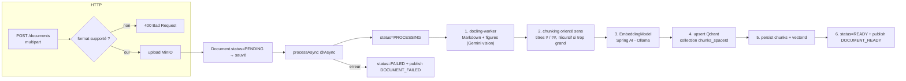

# ingestion-service

> **Statut :** 🟢 Pipeline d'ingestion complet (extraction → chunking → embeddings → indexation Qdrant)
> **Port :** `8083` · **Base :** `ingestion_db` (PostgreSQL) · **Vecteurs :** Qdrant · **Fichiers :** MinIO

Upload, extraction, chunking, embedding et indexation vectorielle des documents de cours.
L'infrastructure (upload MinIO, entités, statuts, endpoints, clients Qdrant/MinIO, publication
d'événements) est **fonctionnelle**, tout comme l'**extraction**, déléguée à un conteneur Python
`docling-worker` spawné à la demande (voir `service/docker/`). Depuis la **spec v2**, le worker
légende les figures et transcrit les documents scannés via l'**API Gemini (vision)** ; les images
extraites sont uplodées ici dans **MinIO** et référencées dans le Markdown. Le **pipeline
(chunking orienté sens, embeddings, upsert Qdrant)** est implémenté, chaque étape vivant dans un
service dédié orchestré par `IngestionPipelineService` — seul un test de bout en bout
(nécessitant Ollama + toute l'infra) reste à effectuer.

## Rôle

1. Recevoir les documents (PDF, DOCX, PPTX, XLSX, XLS, CSV, HTML, EPUB, TXT, Markdown)
   uploadés par les étudiants.
2. Stocker le binaire dans **MinIO** (jamais en base).
3. Traiter **de manière asynchrone** : extraction de texte → découpage en chunks → embeddings →
   indexation dans **Qdrant** (une collection par espace `chunks_{spaceId}`).
4. Publier `DOCUMENT_READY` (avec nombre de chunks) ou `DOCUMENT_FAILED`.

## Choix techniques

- **Asynchrone (`@Async`)** : l'upload répond immédiatement (`201`), le pipeline tourne en
  arrière-plan. L'état du document (statuts) sert de point de synchronisation côté client.
- **Stockage objet MinIO** : `MinioService` gère bucket/upload/download/delete. Seule
  l'**URL logique** (`bucket/spaces/{spaceId}/{uuid}-fichier`) est persistée en base —
  jamais le binaire (contrat de données).
- **Machine à états du document** : `PENDING → PROCESSING → READY | FAILED`. `failure_reason`
  documente les échecs.
- **Base vectorielle Qdrant** (client gRPC configuré dans `QdrantConfig`). Le CDC retenait
  initialement ChromaDB, mais sans client Java officiel mûr → Qdrant. Contrat : une collection
  `chunks_{spaceId}` par espace, metadata `{document_id, space_id, chunk_index, content}`.
  Le client Qdrant déclare gRPC et protobuf en scope `runtime` : deux dépendances explicites
  (`io.grpc:grpc-netty-shaded` et `com.google.protobuf:protobuf-java`, versions alignées sur
  le client 1.13.0 / grpc 1.65.1) sont ajoutées pour le classpath de compilation.
- **Extraction déléguée à `docling-worker/`** (conteneur Python FastAPI spawné à la demande) :
  `DockerWorkerClient` (lib `docker-java`) crée un conteneur `docling-worker-<uuid>` sur le
  réseau `apa-net`, attend son `/health`, appelle `POST /v1/convert` (multipart), puis arrête
  et supprime le conteneur en `finally`. L'extraction MarkItDown (PDF/DOCX/PPTX/XLSX/XLS/CSV/
  HTML/EPUB/TXT/MD → Markdown structuré) est enrichie par la **vision Gemini** (spec v2) :
  légende des images embarquées (`caption_figure`) et transcription des documents scannés
  (`transcribe_full_page`). La clé `GEMINI_API_KEY` est injectée au conteneur à chaque spawn
  (jamais embarquée dans l'image).
- **Images → MinIO (spec v2)** : le worker renvoie les images en **base64** avec des placeholders
  `{{IMAGE:img_001}}`. `ImageUploadService` uploade chacune via `MinioService.uploadBytes`
  (préfixe `spaces/{spaceId}/images/`) puis substitue le placeholder par
  `` + `> **Description :** caption`.
- **Chunking orienté sens** (`MarkdownChunkingService`) : la frontière première des chunks est
  la **structure des titres** (`#`, `##`, …) — chaque section garde son titre avec son contenu.
  Une section trop grande est re-découpée **récursivement** sur le niveau de titre inférieur ;
  ce n'est qu'en dernier recours (aucun sous-titre) qu'on retombe sur une découpe de taille fixe
  avec chevauchement, sur un séparateur d'espace (jamais un mot coupé). Couvert par des tests
  unitaires.
- **Modèle d'embedding via Spring AI Ollama** (`nomic-embed-text` par défaut) — appelé par le
  pipeline (un vecteur par chunk, en lot). Ollama doit donc être démarré pour qu'un document
  atteigne le statut `READY`.
- **Files jamais en base relationnelle** : `chunks` ne stocke que le texte, l'index et le
  `vector_id` (id du point Qdrant) — les vecteurs vivent dans Qdrant.

## Pipeline d'ingestion (implémenté)



> ✅ **État actuel** : le pipeline est **implémenté** de bout en bout — extraction
> (docling-worker + vision Gemini), chunking orienté sens (titres d'abord, découpe de secours
> seulement si une section est trop grande), embeddings (Spring AI / Ollama), upsert Qdrant
> (collection créée si absente), persistance des `Chunk`, statut `READY` avec le vrai
> `chunkCount` et publication `DOCUMENT_READY`. En cas d'échec à n'importe quelle étape :
> `FAILED` + `DOCUMENT_FAILED`. `IngestionPipelineService` n'est plus qu'un orchestrateur :
> chaque étape est déléguée à un service dédié (voir « Cœur IA »). Validé à la compilation,
> par les tests unitaires du chunking et par un smoke test des interactions Qdrant ; le test
> de bout en bout (Ollama + infra complète) reste à exécuter.

## Endpoints

Toutes les routes sont protégées par JWT.

| Méthode | Route | Rôle | Description |
|---|---|---|---|
| POST | `/api/v1/documents?spaceId={id}` | connecté | Upload `multipart/form-data`, champ `file`. Retourne `201` (traitement async) |
| GET | `/api/v1/documents?spaceId={id}` | connecté | Lister les documents d'un espace |
| GET | `/api/v1/documents/{id}` | propriétaire/admin | Détail (inclut le statut) |
| DELETE | `/api/v1/documents/{id}` | propriétaire/admin | Supprimer (BDD + MinIO + Qdrant) |

## Règles métier

- **Formats acceptés** : PDF, DOCX, TXT, **Markdown** (`md`/`markdown`), **PPTX**, **XLSX**,
  **XLS**, **CSV**, **HTML** (`html`/`htm`), **EPUB** — alignés sur les convertisseurs locaux
  de MarkItDown 0.1.7 (vérifié : conversion réelle de chaque format). Accepté si le MIME **ou**
  l'extension est dans la liste (repli pour les clients qui envoient un MIME imprécis, ex.
  `application/octet-stream` pour EPUB). Tout autre format → `400`. Exclus volontairement :
  images/audio (nécessitent un LLM de description/transcription), `zip`, `ipynb`, `msg`.
- **Taille max** : 25 Mo (`multipart.max-file-size` / `max-request-size`).
- **Propriétaire ou admin** requis pour lire/supprimer un document.
- Un document `READY` n'existe qu'**après** indexation réelle dans Qdrant (implémenté).
- **Idempotence** : `deleteDocument` purge chunks + MinIO + points Qdrant (filtre `document_id`)
  avant de supprimer l'entité.

## Événements

| Canal | Événement | Direction | Rôle |
|---|---|---|---|
| `ingestion.events` | `DOCUMENT_READY` / `DOCUMENT_FAILED` | publié | Déclenche enrichissement persona (space-service) + signalement obsolescence des fiches (fiche-service) |
| `space.events` | `SPACE_DELETED` | consommé | Purge tous les documents de l'espace |
| `user.events` | `USER_DELETED` | consommé | Purge tous les documents de l'utilisateur |

## Modèle de données

- `documents` : `id`, `space_id` (logique), `user_id` (logique), `filename`, `mime_type`,
  `storage_url`, `status`, `chunk_count`, `failure_reason`, horodatages.
- `chunks` : `id`, `document_id (FK cascade)`, `chunk_index`, `content`, `token_count`, `vector_id`.

## Cœur IA implémenté

`IngestionPipelineService` est un **orchestrateur** : chaque étape du pipeline vit dans un
service dédié, injecté par constructeur (`@RequiredArgsConstructor`).

| Étape | Service | Responsabilité |
|---|---|---|
| 1. Téléchargement | `MinioService` | binaire du document depuis MinIO |
| 2. Extraction | `DockerWorkerClient` | conteneur docling-worker (conteneur Python spawné) |
| 2bis. Figures | `ImageUploadService` | upload MinIO des images + substitution `{{IMAGE:…}}` |
| 3. Chunking | `MarkdownChunkingService` | découpage orienté sens (titres, récursif) |
| 4. Embeddings | `EmbeddingModel` (Spring AI / Ollama) | un vecteur par chunk, en lot |
| 5-6. Vectoriel | `QdrantVectorService` | collection `chunks_{spaceId}`, upsert, purge |

Points de vigilance et limites :

- **Chunking** (`MarkdownChunkingService`) : taille cible ~500 tokens (≈ 2000 caractères).
  Découpage **par titres d'abord** (une section = un chunk, titre conservé avec son contenu) ;
  une section trop grande est re-découpée récursivement sur le niveau de titre suivant ; sans
  sous-titre, découpe de secours de taille fixe avec chevauchement (50 tokens), sans couper un
  mot. `token_count` = heuristique `chars / 4` (pas de tokenizer dédié) — à ajuster
  empiriquement. Limite connue : un titre dans un bloc de code provoque une fausse frontière,
  et un document très fragmenté peut produire des chunks très petits (une section = un chunk).
  Couvert par des tests unitaires (`MarkdownChunkingServiceTest`).
- **Embeddings** : `EmbeddingModel` Spring AI (Ollama `nomic-embed-text` par défaut), appel en
  lot pour le document. **Ollama doit être démarré** (profil compose `ollama`) sinon le
  document passera en `FAILED`.
- **Qdrant** : collection `chunks_{spaceId}` créée si absente (dimensions déduites des
  embeddings réels, distance **Cosine**), upsert des points avec metadata
  `{document_id, space_id, chunk_index, content}`. `deleteDocument` purge aussi les points
  (filtre `document_id`). Validé par smoke test contre un vrai conteneur Qdrant.
- **Point de vigilance** : l'artifactId du starter Spring AI Ollama a changé entre les
  milestones (`spring-ai-ollama-spring-boot-starter` vs `spring-ai-starter-model-ollama`). Le
  POM utilise la forme **1.0.0** (`spring-ai-starter-model-ollama`), vérifiée compatible avec
  `spring-ai-bom:1.0.0`.

## Variables d'environnement

| Variable | Défaut | Rôle |
|---|---|---|
| `MINIO_URL` / `MINIO_ACCESS_KEY` / `MINIO_SECRET_KEY` / `MINIO_BUCKET` | `http://localhost:9000` / `minioadmin` / `minioadmin` / `documents` | Stockage objet |
| `QDRANT_HOST` / `QDRANT_PORT` / `QDRANT_USE_TLS` | `localhost` / `6334` / `false` | Base vectorielle (gRPC) |
| `OLLAMA_URL` | `http://localhost:11434` | Modèle d'embedding local |
| `OLLAMA_EMBEDDING_MODEL` | `nomic-embed-text` | Modèle d'embedding |
| `DOCKER_HOST_SOCKET` | `unix:///var/run/docker.sock` | Socket Docker (⚠️ accès root sur l'hôte) |
| `DOCLING_WORKER_IMAGE` | `docling-worker:latest` | Image du conteneur d'extraction |
| `DOCKER_NETWORK` | `apa-net` | Réseau Docker que doit rejoindre le worker |
| `DOCLING_WORKER_STARTUP_TIMEOUT` | `30` | Timeout d'attente du `/health` (secondes) |
| `DOCLING_WORKER_CONVERT_TIMEOUT` | `300` | Timeout d'un `POST /v1/convert` (secondes — large : légendes/transcriptions Gemini) |
| `GEMINI_API_KEY` | *(vide)* | Clé API Gemini transmise au conteneur docling-worker (vision) |

## Lancer

```bash
docker compose up -d postgres redis minio qdrant
mvn -pl common,ingestion-service -am spring-boot:run
# Swagger : http://localhost:8083/swagger-ui.html
```

> ⚠️ Pour tester un upload : construire d'abord le conteneur d'extraction
> (`docker build -t docling-worker:latest ./docling-worker`) — sans lui, le document
> passera en `FAILED` (image introuvable).

## Limites connues

- **Concurrence d'ingestion non bornée** : `processAsync` (@Async) utilise le
  `SimpleAsyncTaskExecutor` par défaut (un thread par upload, pas de pool) et chaque
  conversion spawné son propre conteneur `docling-worker`. Sous charge, N uploads
  simultanés = N threads + N conteneurs + N×M appels Gemini → risque de saturation de la
  RAM (local) et de dépassement du quota Gemini. Analyse complète et pistes de correction
  dans [`docs/ingestion-concurrence.md`](../docs/ingestion-concurrence.md).
