# ingestion-service

> **Statut :** 🟢 Pipeline d'ingestion complet (extraction → chunking → embeddings → indexation Qdrant)
> **Port :** `8083` · **Base :** `ingestion_db` (PostgreSQL) · **Vecteurs :** Qdrant · **Fichiers :** MinIO

Upload, extraction, chunking, embedding et indexation vectorielle des documents de cours.
L'infrastructure (upload MinIO, entités, statuts, endpoints, clients Qdrant/MinIO, publication
d'événements) est **fonctionnelle**, tout comme l'**extraction**, déléguée à un conteneur Python
`docling-worker` spawné à la demande (voir `service/docker/`). Depuis la **spec v2**, le worker
légende les figures et transcrit les documents scannés via l'**API Gemini (vision)** ; les images
extraites sont uplodées ici dans **MinIO** et référencées dans le Markdown. Le **pipeline
(chunking orienté structure sur l'AST, embeddings, upsert Qdrant)** est implémenté, chaque étape vivant dans un
service dédié orchestré par `IngestionPipelineService` — seul un test de bout en bout
(nécessitant Ollama + toute l'infra) reste à effectuer.

## Rôle

1. Recevoir les documents (PDF, DOCX, PPTX, XLSX, XLS, CSV, HTML, EPUB, TXT, Markdown)
   uploadés par les étudiants.
2. Stocker le binaire dans **MinIO** (jamais en base).
3. Traiter **de manière asynchrone** : extraction de texte → découpage en chunks → embeddings →
   indexation dans **Qdrant** (collection unique `chunks`, cloisonnée par `space_id` en payload).
4. Publier `DOCUMENT_READY` (avec nombre de chunks) ou `DOCUMENT_FAILED`.

## Choix techniques

- **Asynchrone (`@Async`)** : l'upload répond immédiatement (`201`), le pipeline tourne en
  arrière-plan. L'état du document (statuts) sert de point de synchronisation côté client.
- **Stockage objet MinIO** : `MinioService` gère bucket/upload/download/delete. Seule
  l'**URL logique** (`bucket/spaces/{spaceId}/{uuid}-fichier`) est persistée en base —
  jamais le binaire (contrat de données).
- **Machine à états du document** : `PENDING → PROCESSING → READY | FAILED`. `failure_reason`
  documente les échecs.
- **Base vectorielle Qdrant** (client gRPC configuré dans `QdrantConfig`). Le CDC retenait
  initialement ChromaDB, mais sans client Java officiel mûr → Qdrant. **Option A (multi-tenant)**
  : **une seule collection** `chunks` (configurable via `qdrant.collection-name`), chaque point
  portant metadata `{document_id, space_id, chunk_index, content}` — le cloisonnement par espace
  se fait par **filtre** sur `space_id` au moment du retrieval (ex. `filterExpression` de
  `QuestionAnswerAdvisor`/Spring AI), plus par nom de collection. Le client Qdrant déclare gRPC
  et protobuf en scope `runtime` : deux dépendances explicites (`io.grpc:grpc-netty-shaded` et
  `com.google.protobuf:protobuf-java`, versions alignées sur le client 1.13.0 / grpc 1.65.1)
  sont ajoutées pour le classpath de compilation.
- **Extraction déléguée à `docling-worker/`** (conteneur Python FastAPI spawné à la demande) :
  `DockerWorkerClient` (lib `docker-java`) crée un conteneur `docling-worker-<uuid>` sur le
  réseau `apa-net`, attend son `/health`, appelle `POST /v1/convert` (multipart), puis arrête
  et supprime le conteneur en `finally`. L'extraction MarkItDown (PDF/DOCX/PPTX/XLSX/XLS/CSV/
  HTML/EPUB/TXT/MD → Markdown structuré) est enrichie par la **vision Gemini** (spec v2) :
  légende des images embarquées (`caption_figure`) et transcription des documents scannés
  (`transcribe_full_page`). La clé `GEMINI_API_KEY` est injectée au conteneur à chaque spawn
  (jamais embarquée dans l'image).
- **Images → MinIO (spec v2)** : le worker renvoie les images en **base64** avec des placeholders
  `{{IMAGE:img_001}}`. `ImageUploadService` uploade chacune via `MinioService.uploadBytes`
  (préfixe `spaces/{spaceId}/images/`) puis substitute le placeholder par
  `` + `> **Description :** caption` quand Gemini a produit une légende.
  Si la légende est vide, l'image garde une alt text neutre sans ligne de description vide.
  Chaque image est aussi persistée en base (entité `DocumentImage` : `document_id`,
  `storage_url`, `placeholder_id`, `caption`) — c'est cette table qui alimente la
  **résolution batch** au RAG (`POST /api/v1/documents/images/resolve`). Note : seul le
  placeholder `{{IMAGE:…}}` (double accolades, format non-PDF) est reconnu ; le format
  PDF (`{IMAGE:…}` simple) n'est pas substitué dans le Markdown de preview (cf.
  `docling-worker/README.md`).
- **Chunking orienté structure (spec v3)** : deux chunkers, choisis selon le résultat de
  l'extraction :
  - `StructureAwareChunker` — pour les **PDF** (AST canonique disponible) : découpe directement
    depuis l'**AST typé** du docling-worker. Il préserve la **hiérarchie des titres** (`headingPath`),
    l'**atomicité** des tableaux / blocs de code / figures (jamais cassés même s'ils dépassent la
    taille cible ~1500 chars), les **plages de pages réelles** et les **types d'éléments** contenus
    dans chaque chunk. Un heading est du *contexte* (met à jour le chemin) et non du contenu ; le
    préambule a `headingPath = []` ; les petits chunks (< 100 chars) sont fusionnés **uniquement**
    avec un voisin de même `headingPath`.
  - `MarkdownFallbackChunker` — pour les **non-PDF** (pas d'AST) : découpe le **Markdown brut**
    en suivant les titres (`#`, `##`, …). Les blocs fenced code sont **atomiques**, les titres
    dans un bloc de code sont ignorés, `pageStart`/`pageEnd` fixés à 1. Les invariants (heading =
    contexte, merge petit chunk même `headingPath`) miment `StructureAwareChunker`.
  - Le **Markdown** n'est plus source de chunking : il est conservé pour le **debug/preview**
    uniquement. Couvert par des tests unitaires.
- **Modèle d'embedding via Spring AI Ollama** (`nomic-embed-text` par défaut) — appelé par le
  pipeline (un vecteur par chunk, en lot). Ollama doit donc être démarré pour qu'un document
  atteigne le statut `READY`.
- **Files jamais en base relationnelle** : `chunks` ne stocke que le texte, l'index et le
  `vector_id` (id du point Qdrant) — les vecteurs vivent dans Qdrant.

## Pipeline d'ingestion (implémenté)

```mermaid
flowchart LR
    subgraph HTTP
        UP[POST /documents<br/>multipart] --> VAL{format supporté ?}
        VAL -- non --> 400[400 Bad Request]
        VAL -- oui --> MO[upload MinIO]
    end
    MO --> DOC[Document.status=PENDING → sauvé]
    DOC --> ASYNC[processAsync @Async]
    ASYNC --> ST1[status=PROCESSING]
    ST1 --> DW["1. docling-worker<br/>PDF → AST + Markdown,<br/>non-PDF → Markdown, figures (Gemini vision)"]
    DW --> CHUNK["2. chunking orienté structure :<br/>AST (PDF) → StructureAwareChunker<br/>Markdown brut (non-PDF) → MarkdownFallbackChunker"]
    CHUNK --> IMG["2bis. images → MinIO + DocumentImage,<br/>placeholders du Markdown de preview"]
    IMG --> EMB[3. EmbeddingModel<br/>Spring AI - Ollama]
    EMB --> QD[4. upsert Qdrant<br/>collection unique chunks,<br/>metadata enrichies + space_id en payload]
    QD --> DB[5. persist chunks + vectorId]
    DB --> EV[6. status=READY + publish DOCUMENT_READY]
    ASYNC -- erreur --> FAIL[status=FAILED + publish DOCUMENT_FAILED]
```



> ✅ **État actuel** : le pipeline est **implémenté** de bout en bout — extraction
> (docling-worker spec v3 : PDF → AST, non-PDF → Markdown, vision Gemini), chunking orienté
> structure (AST pour les PDF via `StructureAwareChunker`, fallback Markdown pour les non-PDF),
> embeddings (Spring AI / Ollama), upsert Qdrant (collection créée si absente, metadata
> enrichies), persistance des `Chunk` + `DocumentImage`, statut `READY` avec le vrai
> `chunkCount` et publication `DOCUMENT_READY`. En cas d'échec à n'importe quelle étape :
> `FAILED` + `DOCUMENT_FAILED`. `IngestionPipelineService` n'est plus qu'un orchestrateur :
> chaque étape est déléguée à un service dédié (voir « Cœur IA »). Validé à la compilation,
> par les tests unitaires du chunking et par un smoke test des interactions Qdrant ; le test
> de bout en bout (Ollama + infra complète) reste à exécuter.

## Endpoints

Toutes les routes sont protégées par JWT.

| Méthode | Route | Rôle | Description |
|---|---|---|---|
| POST | `/api/v1/documents?spaceId={id}` | connecté | Upload `multipart/form-data`, champ `file`. Retourne `201` (traitement async) |
| GET | `/api/v1/documents?spaceId={id}` | connecté | Lister les documents d'un espace |
| GET | `/api/v1/documents/{id}` | propriétaire/admin | Détail (inclut le statut) |
| DELETE | `/api/v1/documents/{id}` | propriétaire/admin | Supprimer (BDD + MinIO + Qdrant) |
| POST | `/api/v1/documents/{id}/retry` | propriétaire/admin | Relancer le traitement d'un document échoué/en attente |
| GET | `/api/v1/documents/stream?spaceId={id}` | connecté | SSE pour les statuts de document en temps réel |
| POST | `/api/v1/documents/images/resolve` | connecté | Résolution **batch** d'`image_ids` (metadonnées Qdrant) en `{storage_url, caption}` — utilisé par chat-service au RAG pour enrichir le contexte avec les figures |

## Règles métier

- **Formats acceptés** : PDF, DOCX, PPTX, XLSX, XLS, CSV, TXT, Markdown, HTML, EPUB
  (source unique : `SupportedDocumentType`, à l'aligné du routage du docling-worker). Un format
  est accepté si le **MIME type OU l'extension** correspond à un type supporté. Tout autre
  format → `400`.
- **Taille max** : 20 Mo (`multipart.max-file-size` / `max-request-size`).
- **Propriétaire ou admin** requis pour lire/supprimer un document.
- Un document `READY` n'existe qu'**après** indexation réelle dans Qdrant (implémenté).
- **Idempotence** : `deleteDocument` purge chunks + MinIO + points Qdrant (filtre `document_id`)
  avant de supprimer l'entité.

## Événements

| Canal | Événement | Direction | Rôle |
|---|---|---|---|
| `ingestion.events` | `DOCUMENT_READY` / `DOCUMENT_FAILED` | publié | Déclenche enrichissement persona (space-service) + signalement obsolescence des fiches (fiche-service) |
| `space.events` | `SPACE_DELETED` | consommé | Purge tous les documents de l'espace |
| `user.events` | `USER_DELETED` | consommé | Purge tous les documents de l'utilisateur |

## Modèle de données

- `documents` : `id`, `space_id` (logique), `user_id` (logique), `filename`, `mime_type`,
  `storage_url`, `status`, `chunk_count`, `failure_reason`, horodatages.
- `chunks` : `id`, `document_id (FK cascade)`, `chunk_index`, `content`, `token_count`, `vector_id`.
- `document_images` (spec v2) : `id`, `document_id`, `storage_url` (MinIO), `placeholder_id`,
  `caption`, `created_at` — sert à la résolution batch au RAG (`POST /images/resolve`).

## Cœur IA implémenté

`IngestionPipelineService` est un **orchestrateur** : chaque étape du pipeline vit dans un
service dédié, injecté par constructeur (`@RequiredArgsConstructor`).

| Étape | Service | Responsabilité |
|---|---|---|
| 1. Téléchargement | `MinioService` | binaire du document depuis MinIO |
| 2. Extraction | `DockerWorkerClient` | conteneur docling-worker (conteneur Python spawné) → AST (PDF) + Markdown |
| 2bis. Figures | `ImageUploadService` | upload MinIO des images + persistance `DocumentImage` + substitution `{{IMAGE:…}}` (Markdown de preview) |
| 3. Chunking | `StructureAwareChunker` (PDF, AST) / `MarkdownFallbackChunker` (non-PDF) | découpage orienté structure (titres, atomicité, pages) |
| 4. Embeddings | `EmbeddingModel` (Spring AI / Ollama) | un vecteur par chunk, en lot |
| 5-6. Vectoriel | `QdrantVectorService` | collection unique `chunks` (Option A), upsert, purge |

Points de vigilance et limites :

- **Chunking (spec v3)** :
  - `StructureAwareChunker` (PDF/AST) : taille cible **1500 chars** (`MAX_CHUNK_CHARS`), min
    **100 chars** (`MIN_CHUNK_CHARS`). Un `TABLE`/`CODE`/`FIGURE` est **atomique** (jamais cassé,
    même au-delà de la cible). Un heading est du **contexte** (met à jour `headingPath`), pas du
    contenu ; le préambule a `headingPath = []` ; les petits chunks sont fusionnés uniquement avec
    un voisin de même `headingPath` ; les références de `parent_id` sont protégées contre les
    cycles (profondeur max 10). Chaque chunk retient `pageStart`/`pageEnd`, `elementTypes` et
    `imageIds`.
  - `MarkdownFallbackChunker` (non-PDF) : mêmes cibles (1500/100 chars), découpe le Markdown
    brut en suivant les titres et en **ignorant les titres dans les blocs de code fenced**
    (limite « titre dans un bloc code » résolue) ; blocs fenced code atomiques ; `pageStart`/
    `pageEnd` fixés à 1. Le Markdown est normalisé avant découpage (`\r\n`, `\f`, espaces et
    sauts multiples).
  - `token_count` = `NULL` (pas de tokenizer dédié — V1 nullable, V2 tokenizer réel).
  - Couvert par des tests unitaires (`StructureAwareChunkerTest`, `StructureAwareChunkerIntegrationTest`,
    `MarkdownFallbackChunkerTest`, `ImageUploadServiceTest`, `CanonicalDocumentDeserializationTest`).
- **Embeddings** : `EmbeddingModel` Spring AI (Ollama `nomic-embed-text` par défaut), appel en
  lot pour le document. **Ollama doit être démarré** (profil compose `ollama`) sinon le
  document passera en `FAILED`.
- **Qdrant** : collection **unique** `chunks` (Option A multi-tenant) créée si absente
  (dimensions déduites des embeddings réels, distance **Cosine**), upsert des points avec
  **metadata enrichies** `{document_id, space_id, chunk_index, content, doc_content, page_start,
  page_end, heading_path, element_types, image_ids}` — chaque point porte son `space_id`, le
  retrieval filtrera dessus. `deleteDocument` purge les points du document (filtre
  `document_id`). Les `image_ids` sont résolus au RAG par chat-service via
  `POST /api/v1/documents/images/resolve`. Validé par smoke test contre un vrai conteneur Qdrant.
- **Point de vigilance** : l'artifactId du starter Spring AI Ollama a changé entre les
  milestones (`spring-ai-ollama-spring-boot-starter` vs `spring-ai-starter-model-ollama`). Le
  POM utilise la forme **1.0.0** (`spring-ai-starter-model-ollama`), vérifiée compatible avec
  `spring-ai-bom:1.0.0`.

## Variables d'environnement

| Variable | Défaut | Rôle |
|---|---|---|
| `MINIO_URL` / `MINIO_ACCESS_KEY` / `MINIO_SECRET_KEY` / `MINIO_BUCKET` | `http://localhost:9000` / `minioadmin` / `minioadmin` / `documents` | Stockage objet |
| `QDRANT_HOST` / `QDRANT_PORT` / `QDRANT_USE_TLS` | `localhost` / `6334` / `false` | Base vectorielle (gRPC) |
| `QDRANT_COLLECTION` | `chunks` | Collection unique multi-tenant (Option A — space_id en payload) |
| `OLLAMA_URL` | `http://localhost:11434` | Modèle d'embedding local |
| `OLLAMA_EMBEDDING_MODEL` | `nomic-embed-text` | Modèle d'embedding |
| `DOCKER_HOST_SOCKET` | `unix:///var/run/docker.sock` | Socket Docker (⚠️ accès root sur l'hôte) |
| `DOCLING_WORKER_IMAGE` | `docling-worker:latest` | Image du conteneur d'extraction |
| `DOCKER_NETWORK` | `apa-net` | Réseau Docker que doit rejoindre le worker |
| `DOCLING_WORKER_STARTUP_TIMEOUT` | `30` | Timeout d'attente du `/health` (secondes) |
| `DOCLING_WORKER_CONVERT_TIMEOUT` | `300` | Timeout d'un `POST /v1/convert` (secondes — large : légendes/transcriptions Gemini) |
| `GEMINI_API_KEY` | *(vide)* | Clé API Gemini transmise au conteneur docling-worker (vision) |
| `GEMINI_MODEL` | *(vide)* | Modèle Gemini vision transmis au conteneur docling-worker |
| `DOCKER_GID` | `127` | GID du groupe propriétaire du socket Docker sur l'hôte (déterminé par `stat -c '%g' /var/run/docker.sock`) |
| `INGESTION_CORE_POOL_SIZE` | `2` | Taille du pool de threads pour le pipeline asynchrone |
| `INGESTION_MAX_POOL_SIZE` | `4` | Taille maximale du pool de threads |
| `INGESTION_QUEUE_CAPACITY` | `10` | Capacité de la file d'attente pour les tâches en excès |

## Configuration Docker Socket

L'ingestion-service utilise `docker-java` pour spawner le conteneur `docling-worker` à la demande. Pour que le user non-root `spring` puisse accéder au socket Docker de l'hôte :

1. **Monter le socket** : `/var/run/docker.sock:/var/run/docker.sock`
2. **Ajouter le groupe** : `group_add: - "${DOCKER_GID}"` dans `docker-compose.yml`
3. **Définir `DOCKER_GID`** dans `.env` avec la valeur réelle du GID du groupe socket :
   ```bash
   stat -c '%g' /var/run/docker.sock
   ```

Vérification depuis le conteneur :
```bash
docker exec tsimoka-ingestion-service id
# uid=100(spring) gid=101(spring) groups=101(spring),127
docker exec tsimoka-ingestion-service ls -l /var/run/docker.sock
# srw-rw---- 1 root 127 ...
```

## Lancer

```bash
docker compose up -d postgres redis minio qdrant
mvn -pl common,ingestion-service -am spring-boot:run
# Swagger : http://localhost:8083/swagger-ui.html
```

> ⚠️ Pour tester un upload : construire d'abord le conteneur d'extraction
> (`docker build -t docling-worker:latest ./docling-worker`) — sans lui, le document
> passera en `FAILED` (image introuvable).

## Limites connues

- **Concurrence d'ingestion bornée** : `processAsync` (@Async) utilise un
  `ThreadPoolTaskExecutor` configuré (`ingestionExecutor`) avec pool borné
  (`corePoolSize=2`, `maxPoolSize=4`, `queueCapacity=10`). Les tâches en excès
  utilisent `CallerRunsPolicy` (le thread appelant exécute la tâche). Sous charge,
  les uploads excédentaires ralentissent mais ne crashent pas.
  simultanés = N threads + N conteneurs + N×M appels Gemini → risque de saturation de la
  RAM (local) et de dépassement du quota Gemini. Analyse complète et pistes de correction
  dans [`docs/ingestion-concurrence.md`](../docs/ingestion-concurrence.md).
