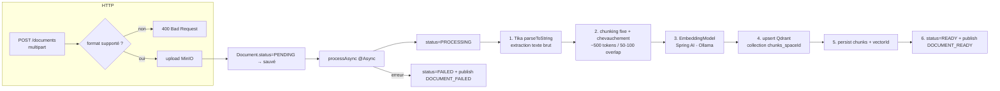

# ingestion-service

> **Statut :** 🟡 Infrastructure complète — pipeline RAG en **TODO**
> **Port :** `8083` · **Base :** `ingestion_db` (PostgreSQL) · **Vecteurs :** Qdrant · **Fichiers :** MinIO

Upload, extraction, chunking, embedding et indexation vectorielle des documents de cours.
L'infrastructure (upload MinIO, entités, statuts, endpoints, clients Qdrant/MinIO, publication
d'événements) est **fonctionnelle** ; le **cœur du pipeline RAG est un TODO explicite** dans
`IngestionPipelineService` — c'est la pièce maîtresse à écrire pour le mémoire.

## Rôle

1. Recevoir les documents (PDF, DOCX, TXT) uploadés par les étudiants.
2. Stocker le binaire dans **MinIO** (jamais en base).
3. Traiter **de manière asynchrone** : extraction de texte → découpage en chunks → embeddings →
   indexation dans **Qdrant** (une collection par espace `chunks_{spaceId}`).
4. Publier `DOCUMENT_READY` (avec nombre de chunks) ou `DOCUMENT_FAILED`.

## Choix techniques

- **Asynchrone (`@Async`)** : l'upload répond immédiatement (`201`), le pipeline tourne en
  arrière-plan. L'état du document (statuts) sert de point de synchronisation côté client.
- **Stockage objet MinIO** : `MinioService` gère bucket/upload/download/delete. Seule
  l'**URL logique** (`bucket/spaces/{spaceId}/{uuid}-fichier`) est persistée en base —
  jamais le binaire (contrat de données).
- **Machine à états du document** : `PENDING → PROCESSING → READY | FAILED`. `failure_reason`
  documente les échecs.
- **Base vectorielle Qdrant** (client gRPC configuré dans `QdrantConfig`). Le CDC retenait
  initialement ChromaDB, mais sans client Java officiel mûr → Qdrant. Contrat : une collection
  `chunks_{spaceId}` par espace, metadata `{document_id, space_id, chunk_index, content}`.
  Le client Qdrant déclare gRPC en scope `runtime` : une dépendance explicite
  `io.grpc:grpc-netty-shaded` (1.65.1) est ajoutée pour le classpath de compilation.
- **Extraction multi-format via Apache Tika** (déjà en dépendance) — couvre PDF/DOCX/TXT en une lib.
- **Modèle d'embedding via Spring AI Ollama** (`nomic-embed-text` par défaut) — configuré mais non appelé.
- **Files jamais en base relationnelle** : `chunks` ne stocke que le texte, l'index et le
  `vector_id` (id du point Qdrant) — les vecteurs vivent dans Qdrant.

## Pipeline d'ingestion (cible)



> ❗ **État actuel** : le bloc réel (Tika → chunks → embeddings → Qdrant) n'est **pas écrit**.
> Le squelette fonctionnel fait transiter les statuts et publie les bons événements avec
> `chunkCount = 0`, pour que le reste de la plateforme reste testable de bout en bout.

## Endpoints

Toutes les routes sont protégées par JWT.

| Méthode | Route | Rôle | Description |
|---|---|---|---|
| POST | `/api/v1/documents?spaceId={id}` | connecté | Upload `multipart/form-data`, champ `file`. Retourne `201` (traitement async) |
| GET | `/api/v1/documents?spaceId={id}` | connecté | Lister les documents d'un espace |
| GET | `/api/v1/documents/{id}` | propriétaire/admin | Détail (inclut le statut) |
| DELETE | `/api/v1/documents/{id}` | propriétaire/admin | Supprimer (BDD + MinIO + Qdrant) |

## Règles métier

- **Formats acceptés** : `application/pdf`, DOCX (`...wordprocessingml.document`),
  `text/plain`. Tout autre mime-type → `400`.
- **Taille max** : 25 Mo (`multipart.max-file-size` / `max-request-size`).
- **Propriétaire ou admin** requis pour lire/supprimer un document.
- Un document `READY` ne doit exister qu'**après** indexation réelle (à implémenter).
- **Idempotence** : `deleteDocument` purge chunks + MinIO (+ Qdrant à implémenter) avant de
  supprimer l'entité.

## Événements

| Canal | Événement | Direction | Rôle |
|---|---|---|---|
| `ingestion.events` | `DOCUMENT_READY` / `DOCUMENT_FAILED` | publié | Déclenche enrichissement persona (space-service) + signalement obsolescence des fiches (fiche-service) |
| `space.events` | `SPACE_DELETED` | consommé | Purge tous les documents de l'espace |
| `user.events` | `USER_DELETED` | consommé | Purge tous les documents de l'utilisateur |

## Modèle de données

- `documents` : `id`, `space_id` (logique), `user_id` (logique), `filename`, `mime_type`,
  `storage_url`, `status`, `chunk_count`, `failure_reason`, horodatages.
- `chunks` : `id`, `document_id (FK cascade)`, `chunk_index`, `content`, `token_count`, `vector_id`.

## Non implémenté (cœur IA du mémoire) — `IngestionPipelineService`

1. **Extraction** : `Tika().parseToString(inputStream)` selon le mime-type.
2. **Chunking fixe avec chevauchement** : point de départ ~500 tokens / chunk, 50-100 tokens
   d'overlap, à ajuster empiriquement.
3. **Embeddings** : `EmbeddingModel` Spring AI (Ollama configuré).
4. **Upsert Qdrant** : créer la collection `chunks_{spaceId}` si absente, upsert des points,
   filtrer/delete les points par `document_id` lors d'une suppression.
5. Mettre à jour `chunkCount` réel et publier `DOCUMENT_READY` **avec le vrai nombre de chunks**.

**Point de vigilance** : l'artifactId du starter Spring AI Ollama a changé entre les milestones
(`spring-ai-ollama-spring-boot-starter` vs `spring-ai-starter-model-ollama`). Le POM utilise la
forme **1.0.0** (`spring-ai-starter-model-ollama`), vérifiée compatible avec `spring-ai-bom:1.0.0`.

## Variables d'environnement

| Variable | Défaut | Rôle |
|---|---|---|
| `MINIO_URL` / `MINIO_ACCESS_KEY` / `MINIO_SECRET_KEY` / `MINIO_BUCKET` | `http://localhost:9000` / `minioadmin` / `minioadmin` / `documents` | Stockage objet |
| `QDRANT_HOST` / `QDRANT_PORT` / `QDRANT_USE_TLS` | `localhost` / `6334` / `false` | Base vectorielle (gRPC) |
| `OLLAMA_URL` | `http://localhost:11434` | Modèle d'embedding local |
| `OLLAMA_EMBEDDING_MODEL` | `nomic-embed-text` | Modèle d'embedding |

## Lancer

```bash
docker compose up -d postgres redis minio qdrant
mvn -pl common,ingestion-service -am spring-boot:run
# Swagger : http://localhost:8083/swagger-ui.html
```
