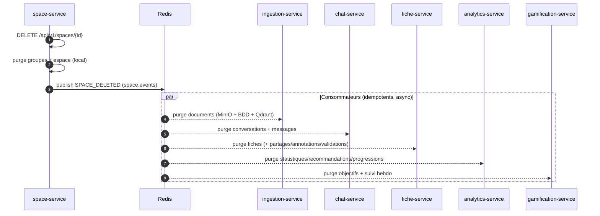
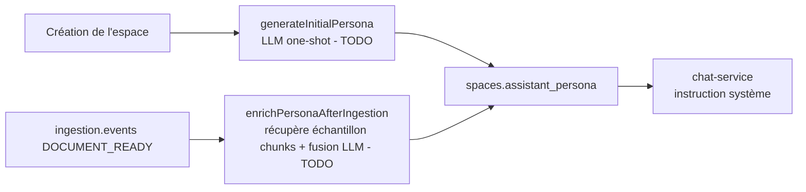

# space-service

> **Statut :** 🟡 CRUD complet — génération du persona pédagogique en **TODO**
> **Port :** `8082` · **Base :** `space_db` (PostgreSQL) · **Migrations :** Flyway

Espaces de cours, groupes de travail et **persona pédagogique**. Le CRUD (espaces, groupes,
membres) est complet et fonctionnel ; la génération/enrichissement du persona par LLM est
le point IA **volontairement laissé à implémenter** pour le mémoire (`PersonaService`).

## Rôle

- **Espace de cours** : créé par un utilisateur, défini par un nom, une description, un tag
  de matière (`subjectTag`) et un **persona** (instructions système du LLM pour cet espace).
- **Groupes de travail** : rattachés à un espace, avec des membres et un rôle par membre
  (`MEMBRE` / `ANIMATEUR`).
- **Persona** : généré à la création de l'espace, enrichi après chaque ingestion de document
  (événement `DOCUMENT_READY`).

## Choix techniques

- **Références logiques, pas de FK inter-service** : `user_id` pointe vers `user-service`
  sans contrainte de base (cf. `ARCHITECTURE.md` §1). Seules les FK *intra-service* existent
  (`groupes.space_id → spaces.id`, `membres_groupe.groupe_id → groupes.id`, en cascade).
- **Persona = texte libre** stocké dans `spaces.assistant_persona` (TEXT). C'est le contrat
  entre ce service et `chat-service` : le persona devient l'instruction système du LLM.
  À l'heure actuelle, un **persona template déterministe** est généré pour que la plateforme
  reste fonctionnelle (pas de blocage en chaîne).
- **Suppression par événements** : `delete()` publie `SPACE_DELETED`. Chaque service concerné
  (ingestion, chat, fiche, analytics, gamification) purge ses données localement. Idem pour
  `USER_DELETED` reçu de `user.events`.
- **Modèle de rôles en groupe** : le **créateur devient `ANIMATEUR`** automatiquement.

## Flux de suppression d'un espace (cascade par événement)



## Cycle de vie du persona



> Les flèches marquées **TODO** renvoient actuellement un persona générique (voir
> `PersonaService`) : l'implémentation réelle est le cœur IA à écrire pour le mémoire.

## Endpoints

Toutes les routes sont protégées par JWT (vérifié à la gateway) ; l'identité vient du header
`X-User-Id`.

| Méthode | Route | Rôle | Description |
|---|---|---|---|
| POST | `/api/v1/spaces` | connecté | Créer un espace (génère le persona) |
| GET | `/api/v1/spaces` | connecté | Lister **mes** espaces |
| GET | `/api/v1/spaces/{id}` | propriétaire/admin | Détail d'un espace |
| PUT | `/api/v1/spaces/{id}` | propriétaire/admin | Mettre à jour nom/description/tag |
| DELETE | `/api/v1/spaces/{id}` | propriétaire/admin | Supprimer (publie `SPACE_DELETED`) |
| POST | `/api/v1/spaces/{spaceId}/groupes` | connecté | Créer un groupe (créateur = ANIMATEUR) |
| GET | `/api/v1/spaces/{spaceId}/groupes` | connecté | Lister les groupes d'un espace |
| POST | `/api/v1/groupes/{groupeId}/membres` | connecté | Ajouter un membre |
| GET | `/api/v1/groupes/{groupeId}/membres` | connecté | Lister les membres |
| DELETE | `/api/v1/groupes/{groupeId}` | connecté | Supprimer un groupe |

## Règles métier

- **Propriétaire ou admin** pour lire/modifier/supprimer un espace ; sinon `403 FORBIDDEN`.
- **`UNIQUE(groupe_id, user_id)`** : un utilisateur ne peut pas être membre deux fois du
  même groupe → `409 CONFLICT`.
- Le **créateur** d'un groupe est automatiquement inscrit comme `ANIMATEUR`.
- La suppression d'un **groupe** supprime aussi ses membres (cascade FK).
- Un `USER_DELETED` reçu supprime **tous les espaces et groupes** de l'utilisateur (cascade
  par événement).

## Événements

| Canal | Événement | Direction | Rôle |
|---|---|---|---|
| `space.events` | `SPACE_DELETED` | publié | Déclenche la purge en cascade des autres services |
| `ingestion.events` | `DOCUMENT_READY` | consommé | Enrichit le persona de l'espace |
| `user.events` | `USER_DELETED` | consommé | Purge les espaces de l'utilisateur |

## Modèle de données

- `spaces` : `id`, `user_id` (logique), `name`, `description`, `subject_tag`, `assistant_persona`, horodatages.
- `groupes` : `id`, `space_id (FK cascade)`, `nom`, `description`, `created_by` (logique).
- `membres_groupe` : `id`, `groupe_id (FK cascade)`, `user_id` (logique), `role_groupe`, `UNIQUE(groupe_id, user_id)`.

## Non implémenté (cœur IA du mémoire)

`PersonaService` — deux méthodes à écrire :

1. **`generateInitialPersona(...)`** : appel LLM one-shot (provider via `ACTIVE_LLM_PROVIDER`)
   à partir du nom/tag/description de l'espace pour produire les instructions système.
2. **`enrichPersonaAfterIngestion(...)`** : récupérer un échantillon des chunks du document
   ingéré (appel REST vers ingestion-service, ou enrichissement de l'événement `DOCUMENT_READY`)
   puis fusionner le vocabulaire disciplinaire dans le persona via un nouvel appel LLM.

**Point ouvert** : enrichir `IngestionEvent` côté ingestion-service pour qu'il transporte
plus d'information exploitable (résumé, extrait), ou faire un appel REST retour — à trancher
dans le mémoire.

## Lancer

```bash
docker compose up -d postgres redis
mvn -pl common,space-service -am spring-boot:run
# Swagger : http://localhost:8082/swagger-ui.html
```
