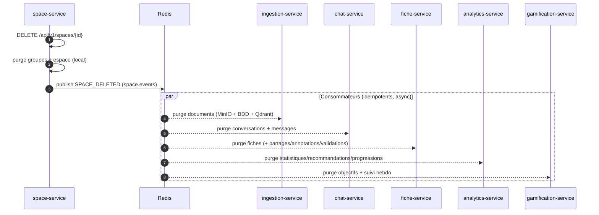
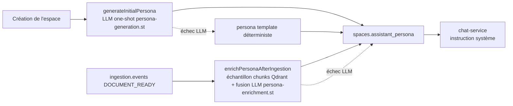

# space-service

> **Statut :** 🟢 CRUD complet + persona pédagogique généré/enrichi par LLM (e2e à valider)
> **Port :** `8082` · **Base :** `space_db` (PostgreSQL) · **Migrations :** Flyway

Espaces de cours, groupes de travail et **persona pédagogique**. Le CRUD (espaces, groupes,
membres) est complet et fonctionnel ; la génération/enrichissement du persona par LLM est
implémentée dans `PersonaService` (prompts `resources/prompts/*.st`, provider via
`ai-common`, circuit breaker `llm-persona`).

## Rôle

- **Espace de cours** : créé par un utilisateur, défini par un nom, une description, un tag
  de matière (`subjectTag`) et un **persona** (instructions système du LLM pour cet espace).
- **Groupes de travail** : rattachés à un espace, avec des membres et un rôle par membre
  (`MEMBRE` / `ANIMATEUR`).
- **Persona** : généré à la création de l'espace, enrichi après chaque ingestion de document
  (événement `DOCUMENT_READY`).

## Choix techniques

- **Références logiques, pas de FK inter-service** : `user_id` pointe vers `user-service`
  sans contrainte de base (cf. `ARCHITECTURE.md` §1). Seules les FK *intra-service* existent
  (`groupes.space_id → spaces.id`, `membres_groupe.groupe_id → groupes.id`, en cascade).
- **Persona = texte libre** stocké dans `spaces.assistant_persona` (TEXT). C'est le contrat
  entre ce service et `chat-service` : le persona devient l'instruction système du LLM.
  Il est **généré par LLM** à la création de l'espace (`persona-generation.st`) puis
  **enrichi par LLM** après chaque ingestion (`persona-enrichment.st`, échantillon de chunks
  lu dans Qdrant). En cas de panne LLM (ou circuit `llm-persona` ouvert), un **persona
  « template » déterministe** est utilisé (génération) ou le persona est **laissé inchangé**
  (enrichissement) : le flux n'est jamais bloqué.
- **Accès au Qdrant** : l'échantillon de chunks est lu via le starter
  `spring-ai-starter-vector-store-qdrant` (collection unique `chunks`, filtre
  `space_id` + `document_id` en payload) — même collection qu'ingestion/chat/fiche.
- **Suppression par événements** : `delete()` publie `SPACE_DELETED`. Chaque service concerné
  (ingestion, chat, fiche, analytics, gamification) purge ses données localement. Idem pour
  `USER_DELETED` reçu de `user.events`.
- **Modèle de rôles en groupe** : le **créateur devient `ANIMATEUR`** automatiquement.

## Flux de suppression d'un espace (cascade par événement)



## Cycle de vie du persona



> Chaîne de repli : échec d'appel LLM ou circuit `llm-persona` ouvert → persona générique
> (création) ou persona inchangé (enrichissement). Le service ne bloque jamais le flux de
> création d'espace ni l'ingestion.

## Endpoints

Toutes les routes sont protégées par JWT (vérifié à la gateway) ; l'identité vient du header
`X-User-Id`.

| Méthode | Route | Rôle | Description |
|---|---|---|---|
| POST | `/api/v1/spaces` | connecté | Créer un espace (génère le persona + le code d'invitation) |
| GET | `/api/v1/spaces` | connecté | Lister **mes** espaces (possédés + rejoints) |
| POST | `/api/v1/spaces/join` | connecté | Rejoindre un espace via son code (`{code}`) |
| GET | `/api/v1/spaces/all` | admin | Vue enseignant : tous les espaces de la plateforme |
| GET | `/api/v1/spaces/{id}` | propriétaire/membre/admin | Détail d'un espace |
| PUT | `/api/v1/spaces/{id}` | propriétaire/admin | Mettre à jour nom/description/tag |
| DELETE | `/api/v1/spaces/{id}` | propriétaire/admin | Supprimer (publie `SPACE_DELETED`) |
| GET | `/api/v1/spaces/{id}/membres` | propriétaire/membre/admin | Lister les membres (hors propriétaire) |
| DELETE | `/api/v1/spaces/{id}/membres/me` | membre | Quitter l'espace |
| DELETE | `/api/v1/spaces/{id}/membres/{memberId}` | propriétaire/admin | Retirer un membre |
| GET | `/api/v1/spaces/{id}/invite-code` | propriétaire/admin | Lire le code d'invitation |
| POST | `/api/v1/spaces/{id}/invite-code/regenerate` | propriétaire/admin | Régénérer le code (l'ancien meurt) |
| POST | `/api/v1/spaces/{spaceId}/groupes` | connecté | Créer un groupe (créateur = ANIMATEUR) |
| GET | `/api/v1/spaces/{spaceId}/groupes` | connecté | Lister les groupes d'un espace |
| POST | `/api/v1/groupes/{groupeId}/membres` | connecté | Ajouter un membre |
| GET | `/api/v1/groupes/{groupeId}/membres` | connecté | Lister les membres |
| DELETE | `/api/v1/groupes/{groupeId}` | connecté | Supprimer un groupe |

## Règles métier

- **Espaces partagés** : un espace reste mono-PROPRIÉTAIRE (`user_id`, écriture réservée).
  Un autre étudiant peut le rejoindre via son **code d'invitation** (8 caractères, alphabet
  sans caractères ambigus O/0/I/1/L) : il devient **membre** — accès en lecture et
  participation, jamais en écriture sur l'espace lui-même. `SpaceResponse.owner` dit au
  client dans quel cas il est.
- Le code n'est exposé que via l'endpoint dédié (propriétaire uniquement) : jamais dans
  `SpaceResponse` lu par un membre.
- **Propriétaire ou admin** pour modifier/supprimer ; lecture étendue aux membres ;
  sinon `403 FORBIDDEN`.
- **`UNIQUE(space_id, user_id)`** sur les adhésions comme sur `UNIQUE(groupe_id, user_id)`
  → doublon = `409 CONFLICT`. Rejoindre son propre espace ou retirer le propriétaire des
  membres = `409 CONFLICT` aussi.
- **`UNIQUE(invite_code)`** sur `spaces` ; régénération possible à tout moment.
- Le **créateur** d'un groupe est automatiquement inscrit comme `ANIMATEUR`.
- La suppression d'un **groupe** supprime aussi ses membres (cascade FK) ; la suppression
  d'un **espace** supprime groupes ET adhésions (cascade FK).
- Un `USER_DELETED` reçu supprime **tous les espaces et groupes** de l'utilisateur (cascade
  par événement) ; ses adhésions partent en cascade avec les espaces.

## Événements

| Canal | Événement | Direction | Rôle |
|---|---|---|---|
| `space.events` | `SPACE_DELETED` | publié | Déclenche la purge en cascade des autres services |
| `ingestion.events` | `DOCUMENT_READY` | consommé | Enrichit le persona de l'espace |
| `user.events` | `USER_DELETED` | consommé | Purge les espaces de l'utilisateur |

⚠️ Pas d'événement `MEMBER_REMOVED` : retirer un membre ne purge rien chez les autres
services (ses conversations/fiches restent dans l'historique de l'espace — choix assumé,
à re-discuter si la RGPD entre en jeu).

## Modèle de données

Migrations Flyway (`db/migration`) : `V1__init.sql` (schéma initial),
`V2__invite_code_and_membres.sql` (partage).

- `spaces` : `id`, `user_id` (logique), `name`, `description`, `subject_tag`,
  `assistant_persona`, `invite_code UNIQUE NOT NULL`, horodatages.
- `membres_space` : `id`, `space_id (FK cascade)`, `user_id` (logique), `joined_at`,
  `UNIQUE(space_id, user_id)` — adhésions via code d'invitation.
- `groupes` : `id`, `space_id (FK cascade)`, `nom`, `description`, `created_by` (logique).
- `membres_groupe` : `id`, `groupe_id (FK cascade)`, `user_id` (logique), `role_groupe`, `UNIQUE(groupe_id, user_id)`.

## Cœur IA : `PersonaService`

1. **`generateInitialPersona(spaceName, subjectTag, description)`** : appel LLM one-shot
   (provider via `ACTIVE_LLM_PROVIDER`, cf. `ai-common`) avec le prompt
   `persona-generation.st`, à partir du nom/tag/description de l'espace, pour produire les
   instructions système injectées par chat-service. Fallback = persona « template ».
2. **`enrichPersonaAfterIngestion(currentPersona, spaceId, documentId, chunkCount)`** :
   lit un échantillon des chunks du document ingéré **directement dans Qdrant** (filtre
   `space_id == 'x' and document_id == 'y'`, seuil 0, requête neutre — on veut un échantillon
   représentatif, pas les chunks « les plus proches ») puis fusionne le vocabulaire
   disciplinaire dans le persona via `persona-enrichment.st`. Fallback = persona inchangé.

**Point ouvert** : la taille d'échantillon est fixée par `persona.sample-size` (défaut 8
chunks, tronqués à 800 caractères). À ajuster empiriquement lors du test e2e.

## Lancer

```bash
docker compose --profile ollama up -d postgres redis qdrant ollama
mvn -pl common,ai-common,space-service -am spring-boot:run
# Swagger : http://localhost:8082/swagger-ui.html
```
