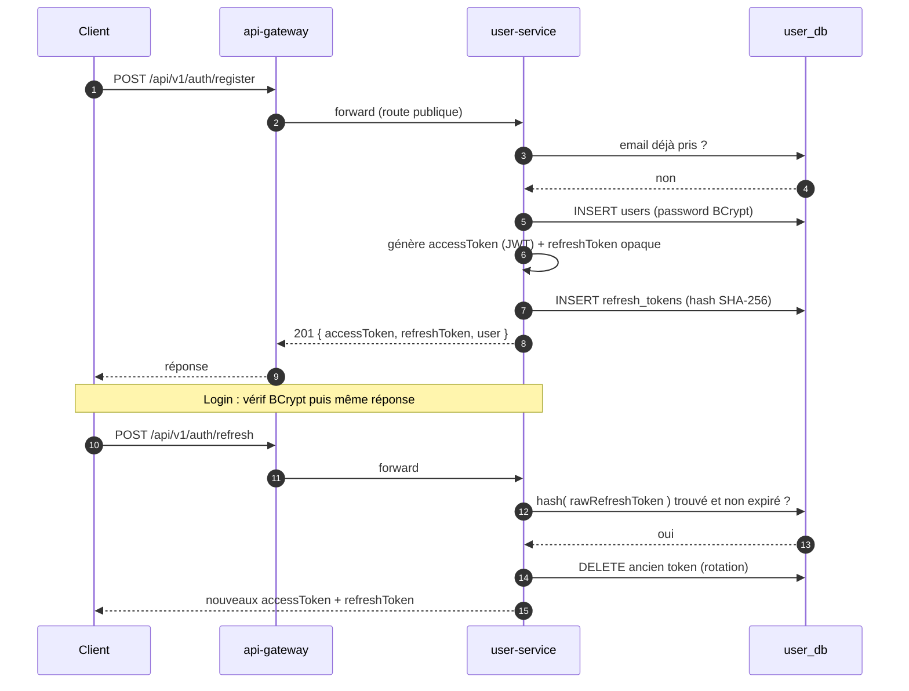

# user-service

> **Statut :** ✅ Complet
> **Port :** `8081` · **Base :** `user_db` (PostgreSQL) · **Migrations :** Flyway

Authentification, comptes et gestion des jetons. Service « générique » : aucune IA, aucune
extension prévue — l'implémentation fournie est **complète et fonctionnelle**.

## Rôle

- Inscription / connexion / rafraîchissement de session.
- Émission des **JWT d'accès** (vérifiés ensuite uniquement par `api-gateway`).
- **Refresh tokens** opaques, stockés **hachés** (SHA-256), avec rotation.
- Profil utilisateur et suppression de compte (déclenche la cascade par événement `USER_DELETED`).

## Choix techniques

- **BCrypt via `spring-security-crypto` uniquement** — pas de `spring-boot-starter-security`.
  Les filtres/login Spring Security seraient inutiles ici : l'authentification est faite
  manuellement (`AuthService`) et l'autorisation est déléguée à la gateway + headers de contexte.
- **JWT signés en HMAC-SHA256** (lib `jjwt`) avec une clé partagée `JWT_SECRET` avec la gateway.
  Claims portés : `sub` = `userId`, `email`, `role`. TTL par défaut **15 min** (configurable).
- **Refresh token opaque + rotation** : 48 octets aléatoires (`SecureRandom`), Base64 URL,
  stockés **hachés** en base (un vol de base ne permet pas de réutiliser les tokens), TTL 30 jours.
  À chaque rafraîchissement, l'ancien token est **invalidé** (rotation).
- **Modèle de rôles** : `STUDENT` / `ADMIN`. Dans ce projet, un **enseignant est un compte
  `ADMIN`** (la validation des fiches vérifie `isAdmin()`). Le check `ENSEIGNANT` présent dans
  `UserContext.isAdmin()` est défensif/futur.
- **Base dédiée** : `user_db`, propriétaire exclusive de ses tables (aucune FK vers d'autres services).

## Flux d'authentification



## Endpoints

Tous renvoient l'enveloppe uniforme `ApiResponse`. Routes publiques : `/auth/**` (passent
par la gateway sans JWT). Routes protégées : `/users/**` (JWT vérifié à la gateway).

| Méthode | Route | Rôle | Description |
|---|---|---|---|
| POST | `/api/v1/auth/register` | public | Inscription (email, mot de passe, displayName, rôle optionnel) |
| POST | `/api/v1/auth/login` | public | Connexion → access + refresh token |
| POST | `/api/v1/auth/refresh` | public | Échange d'un refresh token contre une nouvelle paire |
| GET | `/api/v1/users/me` | connecté | Profil courant (déduit du header `X-User-Id`) |
| PATCH | `/api/v1/users/me` | connecté | Mise à jour du displayName |
| DELETE | `/api/v1/users/me` | connecté | Suppression du compte → publie `USER_DELETED` |
| GET | `/api/v1/users/{id}` | connecté | Profil d'un utilisateur (soi-même ou admin) |

## Règles métier

- **Email unique** : un second compte avec le même email → `409 CONFLICT`.
- **Erreurs d'authentification volontairement génériques** : « Email ou mot de passe
  incorrect » dans les deux cas (login inconnu **et** mot de passe faux) pour ne pas révéler
  l'existence d'un compte.
- **Rotation des refresh tokens** : chaque usage invalide le précédent. Un token expiré est
  supprimé et la requête échoue (→ reconnexion).
- **Suppression de compte** : supprime les refresh tokens puis le compte, et publie
  `USER_DELETED` sur `user.events`. La purge des données de l'utilisateur dans **tous** les
  autres services est déléguée à ces services (par événement, jamais par appel synchrone).

## Événements

| Canal | Événement | Direction | Effet attendu côté consommateurs |
|---|---|---|---|
| `user.events` | `USER_DELETED` | publié | Suppression des espaces, documents, conversations, fiches, analytics, gamification |

## Modèle de données

- `users` : `id (UUID)`, `email (unique)`, `password_hash`, `display_name`, `role`,
  `created_at`, `updated_at`.
- `refresh_tokens` : `id`, `user_id (FK → users, cascade)`, `token_hash`, `expires_at`, `created_at`.

## Variables d'environnement

| Variable | Défaut | Rôle |
|---|---|---|
| `SERVER_PORT` | `8081` | Port d'écoute |
| `DB_URL` | `jdbc:postgresql://localhost:5432/user_db` | Connexion à la base |
| `DB_USERNAME` / `DB_PASSWORD` | `postgres` / `postgres` | Identifiants base |
| `JWT_SECRET` | — (dev) | Clé HMAC, **doit être identique à api-gateway** |
| `JWT_ACCESS_TTL_SECONDS` | `900` | TTL du JWT d'accès (15 min) |

## Lancer

```bash
docker compose up -d postgres
mvn -pl common,user-service -am spring-boot:run
# Swagger : http://localhost:8081/swagger-ui.html
```
